# SyncSpace 요구사항 분석서

문서번호 : `[SyncSpace]요구사항분석서_20260509_Doc-001`  
소 속 : 한국항공대학교  
팀 명 : SyncSpace  
팀 원 : 최민서  
교 수 : 오명원 교수님  

---

## 제/개정 이력

| 버전 | 날짜 | 작성자 | 제/개정사항 | 비고 |
|---|---|---|---|---|
| 1.0 | 2026-05-09 | 최민서 | 요구사항 분석서 최초 작성 | 최초 작성 |
| 1.1 | 2026-05-09 | 최민서 | 유스케이스 설명 형식 보완, U_13 추가, Actor 설명 보완 | 수정 |
| 1.2 | 2026-05-09 | 최민서 | Use Case Diagram 분리, 클래스 관계 수정, 정적 분석 보완, 시퀀스 예외 흐름 추가 | 수정 |
| 1.3 | 2026-05-09 | 최민서 | 관리자 정책 관리 Subflow 보완, 주요 시퀀스 다이어그램 예외 흐름 추가 | 수정 |
| 1.4 | 2026-05-09 | 최민서 | Mermaid Sequence Diagram 렌더링 오류 수정 | 수정 |

---

## 목차

1. [서론](#1-서론)  
   1.1 [목적 및 범위](#11-목적-및-범위)  
   1.2 [용어 정의](#12-용어-정의)  
   1.3 [참조 문서](#13-참조-문서)  
2. [시스템 개요](#2-시스템-개요)  
   2.1 [소프트웨어 컨텍스트](#21-소프트웨어-컨텍스트)  
   2.2 [Actor Table](#22-actor-table)  
   2.3 [Use Case Diagram](#23-use-case-diagram)  
   2.4 [기능 분류 및 설명](#24-기능-분류-및-설명)  
3. [요구사항 명세](#3-요구사항-명세)  
   3.1 [정적 분석](#31-정적-분석)  
   3.2 [CRC 카드](#32-crc-카드)  
   3.3 [동적 분석](#33-동적-분석)  
4. [인터페이스 분석](#4-인터페이스-분석)  
5. [제약사항](#5-제약사항)  
6. [요구사항 추적표](#6-요구사항-추적표)  
7. [참고문헌 및 부록](#7-참고문헌-및-부록)

---

# 1. 서론

## 1.1 목적 및 범위

본 문서는 **SyncSpace(조직 내부용 클라우드 파일 공유 시스템)**의 요구사항을 분석하기 위한 문서이다. SyncSpace는 조직 내부에서 발생하는 파일 분산 관리, 최신 버전 혼선, 외부 공유 보안 문제, 대용량 파일 업로드 실패, 권한 관리의 어려움을 해결하기 위한 웹 기반 파일 공유 시스템이다.

본 요구사항 분석서는 이전 단계에서 작성한 요구사항 정의서를 바탕으로 시스템의 주요 기능을 유스케이스로 분석하고, 각 기능을 수행하기 위해 필요한 객체와 객체 간 관계를 도출하는 것을 목적으로 한다.

본 문서의 범위는 다음과 같다.

1. SyncSpace 시스템의 사용자와 외부 시스템을 식별한다.
2. 주요 기능을 유스케이스 단위로 분석한다.
3. 유스케이스별 정상 흐름과 예외 흐름을 정의한다.
4. 시스템을 구성하는 주요 클래스를 식별한다.
5. CRC 카드를 통해 각 클래스의 책임과 협력 객체를 정의한다.
6. 주요 기능의 동적 흐름을 순차적으로 분석한다.
7. 요구사항과 유스케이스 간 추적성을 정리한다.

---

## 1.2 용어 정의

| 용어 | 설명 |
|---|---|
| SyncSpace | 조직 내부 파일을 안전하게 저장, 검색, 공유, 관리하기 위한 웹 기반 클라우드 파일 공유 시스템 |
| 사용자 | SyncSpace에 가입하여 파일 업로드, 다운로드, 검색, 공유 등의 기능을 사용하는 일반 구성원 |
| 관리자 | 사용자 계정, 권한, 저장 공간, 공유 정책, 접근 로그 등을 관리하는 사용자 |
| 외부 사용자 | 외부 링크를 통해 공유된 파일에 접근하는 시스템 외부 사용자 |
| 파일 | 사용자가 시스템에 업로드하는 문서, 이미지, PDF, 압축 파일, 영상 파일, 데이터 파일 등을 의미 |
| 폴더 | 파일을 분류하고 계층적으로 관리하기 위한 저장 단위 |
| 메타데이터 | 파일명, 파일 크기, 파일 유형, 업로더, 업로드 일시, 저장 위치 등 파일에 대한 부가 정보 |
| 권한 | 사용자가 특정 파일 또는 폴더에 대해 수행할 수 있는 보기, 다운로드, 수정, 공유 등의 접근 범위 |
| 외부 링크 | 시스템 외부 사용자에게 파일을 공유하기 위해 생성되는 URL |
| 만료 기간 | 외부 링크를 사용할 수 있는 기간 |
| 버전 관리 | 파일 수정 이력을 저장하고 이전 버전으로 복원할 수 있도록 관리하는 기능 |
| 삭제 파일 복구 | 삭제된 파일을 일정 기간 동안 보관하고 필요 시 복원하는 기능 |
| 대용량 파일 업로드 | 100MB 이상의 업무용 파일을 시스템에 업로드하는 기능 |
| 이어올리기 | 네트워크 장애 등으로 업로드가 중단되었을 때 처음부터 다시 업로드하지 않고 중단 지점부터 업로드를 재개하는 기능 |
| 접근 로그 | 파일 열람, 다운로드, 공유, 권한 변경 등 사용자의 주요 행위를 기록한 이력 |
| 정책 | 저장 공간, 외부 공유 허용 여부, 삭제 파일 보관 기간 등 시스템 운영 기준 |

---

## 1.3 참조 문서

| 문서명 | 설명 |
|---|---|
| `doc/proposal.md` | SyncSpace 프로젝트 제안서 |
| `doc/project2.md` | 품질 요소 추정서 |
| `doc/project_plan.md` | 프로젝트 관리 계획서 |
| `doc/requirements.md` | 요구사항 정의서 |
| `README.md` | 프로젝트 저장소 안내 문서 |
| `샘플_요구사항분석서.pdf` | 요구사항 분석서 작성 형식 참고 문서 |
| `ch08_객체지향 분석.pdf` | 객체지향 분석 및 UML 모델링 수업 자료 |

---

# 2. 시스템 개요

## 2.1 소프트웨어 컨텍스트

SyncSpace는 사용자가 웹 브라우저를 통해 파일을 업로드하고, 업로드된 파일을 폴더 단위로 관리하며, 내부 사용자 또는 외부 링크를 통해 공유할 수 있도록 지원한다. 또한 시스템은 파일 메타데이터, 권한 정보, 버전 이력, 접근 로그 등을 데이터베이스에 저장한다.

관리자는 사용자 계정과 권한을 관리하고, 저장 공간 정책과 외부 공유 정책을 설정하며, 파일 접근 및 공유 로그를 확인할 수 있다.

외부 사용자는 SyncSpace에 직접 가입하지 않더라도, 내부 사용자가 생성한 외부 공유 링크를 통해 제한된 범위에서 파일에 접근할 수 있다.

### 2.1.1 소프트웨어 컨텍스트 다이어그램

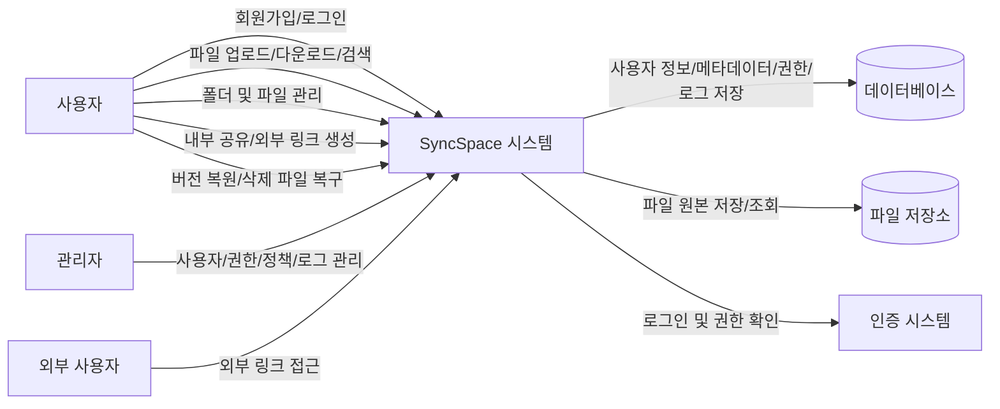
```mermaid
flowchart LR
    User[사용자] -->|회원가입/로그인| SyncSpace[SyncSpace 시스템]
    User -->|파일 업로드/다운로드/검색| SyncSpace
    User -->|폴더 및 파일 관리| SyncSpace
    User -->|내부 공유/외부 링크 생성| SyncSpace
    User -->|버전 복원/삭제 파일 복구| SyncSpace

    Admin[관리자] -->|사용자/권한/정책/로그 관리| SyncSpace

    ExternalUser[외부 사용자] -->|외부 링크 접근| SyncSpace

    SyncSpace -->|사용자 정보/메타데이터/권한/로그 저장| DB[(데이터베이스)]
    SyncSpace -->|파일 원본 저장/조회| Storage[(파일 저장소)]
    SyncSpace -->|로그인 및 권한 확인| Auth[인증 시스템]
```

---

## 2.2 Actor Table

본 문서에서는 사용자 역할뿐 아니라 SyncSpace와 상호작용하는 외부 시스템 및 저장 구성요소도 Actor로 식별한다.

| Actor | Role |
|---|---|
| 사용자 | SyncSpace의 일반 사용자로, 파일 업로드, 다운로드, 검색, 폴더 관리, 공유, 버전 복원, 삭제 파일 복구 기능을 사용한다. |
| 관리자 | SyncSpace의 운영자로, 사용자 계정, 권한, 저장 공간, 외부 공유 정책, 접근 로그를 관리한다. |
| 외부 사용자 | 외부 링크를 통해 공유된 파일에 접근하는 시스템 외부 사용자이다. |
| 인증 시스템 | 사용자 로그인과 권한 확인을 처리한다. |
| 데이터베이스 | 사용자 정보, 파일 메타데이터, 권한 정보, 버전 이력, 접근 로그를 저장하고 조회한다. |
| 파일 저장소 | 사용자가 업로드한 실제 파일 데이터를 저장하고 제공한다. |

---

## 2.3 Use Case Diagram

GitHub Markdown에서는 UML Use Case 전용 문법을 직접 지원하지 않으므로, 아래와 같이 Mermaid flowchart로 유스케이스 관계를 표현한다. 하나의 다이어그램에 모든 기능을 배치하면 복잡해질 수 있으므로, 사용자 기능, 관리자 기능, 외부 사용자 기능으로 나누어 표현한다.

### 2.3.1 사용자 기능 Use Case Diagram

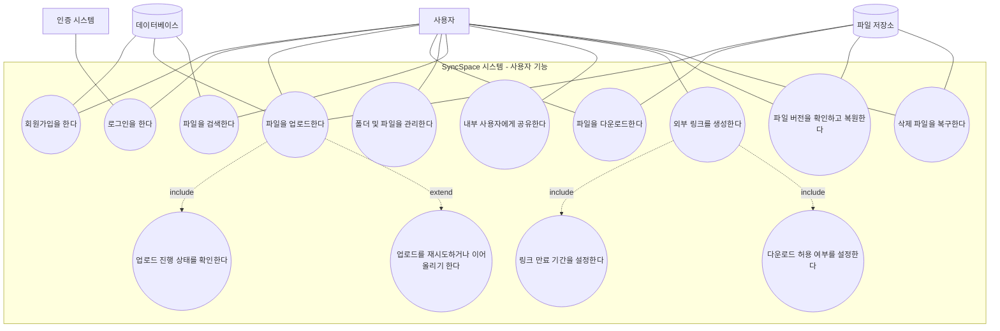
```mermaid
flowchart TB
    subgraph S[SyncSpace 시스템 - 사용자 기능]
        U01((회원가입을 한다))
        U02((로그인을 한다))
        U03((파일을 업로드한다))
        U03A((업로드 진행 상태를 확인한다))
        U03B((업로드를 재시도하거나 이어올리기 한다))
        U04((파일을 다운로드한다))
        U05((폴더 및 파일을 관리한다))
        U06((파일을 검색한다))
        U07((내부 사용자에게 공유한다))
        U08((외부 링크를 생성한다))
        U08A((링크 만료 기간을 설정한다))
        U08B((다운로드 허용 여부를 설정한다))
        U09((파일 버전을 확인하고 복원한다))
        U10((삭제 파일을 복구한다))
    end

    User[사용자] --- U01
    User --- U02
    User --- U03
    User --- U04
    User --- U05
    User --- U06
    User --- U07
    User --- U08
    User --- U09
    User --- U10

    Auth[인증 시스템] --- U02
    DB[(데이터베이스)] --- U01
    DB --- U03
    DB --- U06
    Storage[(파일 저장소)] --- U03
    Storage --- U04
    Storage --- U09
    Storage --- U10

    U03 -. include .-> U03A
    U03 -. extend .-> U03B
    U08 -. include .-> U08A
    U08 -. include .-> U08B
```

### 2.3.2 관리자 기능 Use Case Diagram

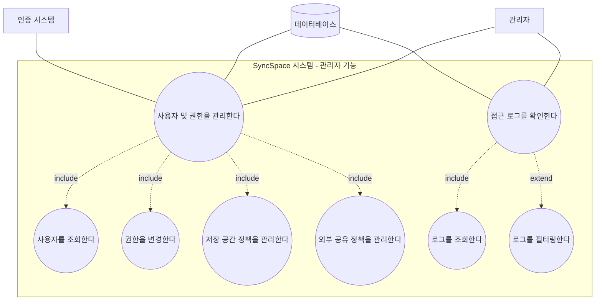
```mermaid
flowchart TB
    subgraph S[SyncSpace 시스템 - 관리자 기능]
        U11((사용자 및 권한을 관리한다))
        U11A((사용자를 조회한다))
        U11B((권한을 변경한다))
        U11C((저장 공간 정책을 관리한다))
        U11D((외부 공유 정책을 관리한다))
        U12((접근 로그를 확인한다))
        U12A((로그를 조회한다))
        U12B((로그를 필터링한다))
    end

    Admin[관리자] --- U11
    Admin --- U12

    DB[(데이터베이스)] --- U11
    DB --- U12
    Auth[인증 시스템] --- U11

    U11 -. include .-> U11A
    U11 -. include .-> U11B
    U11 -. include .-> U11C
    U11 -. include .-> U11D
    U12 -. include .-> U12A
    U12 -. extend .-> U12B
```

### 2.3.3 외부 사용자 기능 Use Case Diagram

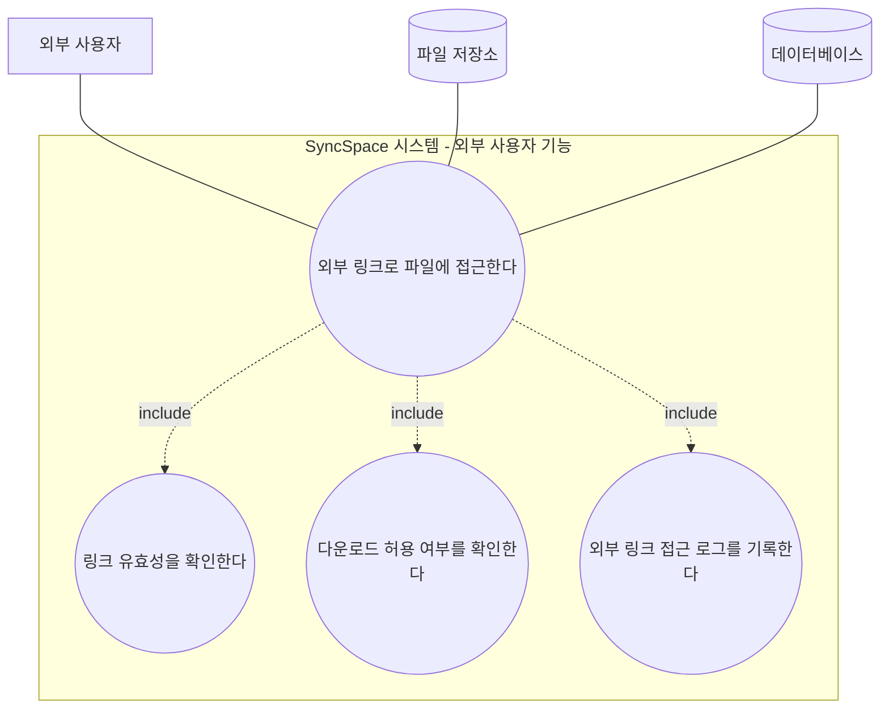
```mermaid
flowchart TB
    subgraph S[SyncSpace 시스템 - 외부 사용자 기능]
        U13((외부 링크로 파일에 접근한다))
        U13A((링크 유효성을 확인한다))
        U13B((다운로드 허용 여부를 확인한다))
        U13C((외부 링크 접근 로그를 기록한다))
    end

    ExternalUser[외부 사용자] --- U13
    Storage[(파일 저장소)] --- U13
    DB[(데이터베이스)] --- U13

    U13 -. include .-> U13A
    U13 -. include .-> U13B
    U13 -. include .-> U13C
```

---

## 2.4 기능 분류 및 설명

### 2.4.1 Use Case Description

---

### Use Case Name: 회원가입을 한다

| 항목 | 내용 |
|---|---|
| ID | U_01 |
| Importance Level | High |
| Primary Actor | 사용자 |
| Use Case Type | Detail, Essential |
| Brief Description | 사용자가 SyncSpace를 이용하기 위해 계정을 생성하는 기능이다. |
| Trigger | 사용자가 회원가입 버튼을 누른다. |
| Relationships | Association: 사용자, 데이터베이스 / Include: 없음 / Extend: 없음 / Generalization: 없음 |

**Stakeholders and Interests**

- 사용자: 시스템을 사용하기 위해 계정을 생성하고자 한다.
- 시스템: 중복되지 않은 계정 정보를 저장해야 한다.
- 관리자: 등록된 사용자를 관리할 수 있어야 한다.

**Normal Flow of Events**

1. 사용자는 회원가입 화면에 접속한다.
2. 사용자는 아이디, 비밀번호, 이메일 주소를 입력한다.
3. 사용자는 회원가입 버튼을 누른다.
4. 시스템은 입력값의 누락 여부를 확인한다.
5. 시스템은 동일한 아이디 또는 이메일이 존재하는지 확인한다.
6. 시스템은 사용자 정보를 데이터베이스에 저장한다.
7. 시스템은 회원가입 성공 메시지를 출력하고 로그인 화면으로 이동한다.

**Subflows**

없음.

**Alternate / Exceptional Flows**

- 4.a1: 필수 입력값이 누락된 경우, 시스템은 누락된 항목을 안내하고 회원가입을 중단한다.
- 5.a1: 이미 사용 중인 아이디 또는 이메일이 존재하는 경우, 시스템은 중복 오류 메시지를 출력한다.
- 6.a1: 데이터베이스 저장에 실패한 경우, 시스템은 회원가입 실패 메시지를 출력한다.

---

### Use Case Name: 로그인을 한다

| 항목 | 내용 |
|---|---|
| ID | U_02 |
| Importance Level | High |
| Primary Actor | 사용자 |
| Use Case Type | Detail, Essential |
| Brief Description | 사용자가 아이디와 비밀번호를 입력하여 SyncSpace에 접속하는 기능이다. |
| Trigger | 사용자가 로그인 버튼을 누른다. |
| Relationships | Association: 사용자, 인증 시스템, 데이터베이스 / Include: 없음 / Extend: 없음 / Generalization: 없음 |

**Stakeholders and Interests**

- 사용자: 본인의 계정으로 시스템에 접속하고자 한다.
- 시스템: 인증된 사용자만 주요 기능에 접근하도록 해야 한다.
- 관리자: 권한 없는 사용자의 접근을 차단해야 한다.

**Normal Flow of Events**

1. 사용자는 로그인 화면에 접속한다.
2. 사용자는 아이디와 비밀번호를 입력한다.
3. 사용자는 로그인 버튼을 누른다.
4. 시스템은 입력된 계정 정보를 인증 시스템에 전달한다.
5. 인증 시스템은 데이터베이스의 사용자 정보와 비교한다.
6. 인증에 성공하면 시스템은 메인 화면으로 이동한다.
7. 시스템은 사용자 권한에 따라 접근 가능한 메뉴를 표시한다.

**Subflows**

S-1: 로그인 성공

1. 시스템은 사용자 세션을 생성한다.
2. 시스템은 사용자의 권한 정보를 불러온다.
3. 시스템은 메인 화면을 표시한다.

S-2: 로그인 실패

1. 시스템은 로그인 실패 사유를 화면에 출력한다.
2. 사용자는 아이디 또는 비밀번호를 다시 입력한다.

**Alternate / Exceptional Flows**

- 4.a1: 아이디 또는 비밀번호가 입력되지 않은 경우, 시스템은 입력 오류 메시지를 출력한다.
- 5.a1: 계정 정보가 일치하지 않는 경우, 시스템은 로그인 실패 메시지를 출력한다.
- 5.a2: 비활성화된 계정인 경우, 시스템은 관리자에게 문의하라는 메시지를 출력한다.

---

### Use Case Name: 파일을 업로드한다

| 항목 | 내용 |
|---|---|
| ID | U_03 |
| Importance Level | High |
| Primary Actor | 사용자 |
| Use Case Type | Detail, Essential |
| Brief Description | 사용자가 문서, 이미지, PDF, 압축 파일, 영상 파일, 데이터 파일 등을 SyncSpace에 업로드하는 기능이다. |
| Trigger | 사용자가 파일 업로드 버튼을 누른다. |
| Relationships | Association: 사용자, 파일 저장소, 데이터베이스 / Include: 업로드 진행 상태를 확인한다 / Extend: 업로드를 재시도하거나 이어올리기 한다 / Generalization: 없음 |

**Stakeholders and Interests**

- 사용자: 업무 파일을 안전하게 저장하고자 한다.
- 시스템: 파일 원본과 메타데이터를 정확히 저장해야 한다.
- 관리자: 조직의 저장 공간 정책에 맞게 파일 업로드가 수행되길 원한다.

**Normal Flow of Events**

1. 사용자는 파일 업로드 화면에 접속한다.
2. 사용자는 업로드할 파일을 선택한다.
3. 시스템은 파일 유형과 파일 크기를 확인한다.
4. 사용자는 업로드 버튼을 누른다.
5. 시스템은 파일 업로드 진행률을 화면에 표시한다.
6. 시스템은 파일 원본을 파일 저장소에 저장한다.
7. 시스템은 파일명, 크기, 유형, 업로더, 업로드 일시, 저장 위치 등의 메타데이터를 데이터베이스에 저장한다.
8. 시스템은 업로드 완료 메시지를 출력한다.
9. 사용자는 업로드된 파일을 목록에서 확인한다.

**Subflows**

S-1: 업로드 진행 상태 확인

1. 시스템은 업로드 진행률을 백분율 또는 진행 바로 표시한다.
2. 시스템은 대용량 파일 업로드 시 진행률을 일정 간격으로 갱신한다.

S-2: 업로드 재시도 또는 이어올리기

1. 업로드가 중단된 경우 시스템은 중단 지점을 확인한다.
2. 사용자가 재시도를 선택하면 시스템은 중단 지점부터 업로드를 재개한다.

**Alternate / Exceptional Flows**

- 2.a1: 파일을 선택하지 않은 경우, 시스템은 파일 선택 안내 메시지를 출력한다.
- 3.a1: 허용되지 않은 파일 형식인 경우, 시스템은 업로드를 제한한다.
- 3.a2: 저장 공간 한도를 초과한 경우, 시스템은 업로드 실패 메시지를 출력한다.
- 6.a1: 파일 저장소 저장에 실패한 경우, 시스템은 업로드 실패 메시지를 출력한다.
- 7.a1: 메타데이터 저장에 실패한 경우, 시스템은 파일 원본 저장을 취소하거나 오류 상태로 기록한다.

---

### Use Case Name: 파일을 다운로드한다

| 항목 | 내용 |
|---|---|
| ID | U_04 |
| Importance Level | High |
| Primary Actor | 사용자 |
| Use Case Type | Detail, Essential |
| Brief Description | 사용자가 SyncSpace에 저장된 파일을 다운로드하는 기능이다. |
| Trigger | 사용자가 파일 목록에서 다운로드 버튼을 누른다. |
| Relationships | Association: 사용자, 파일 저장소, 데이터베이스 / Include: 권한을 확인한다 / Extend: 없음 / Generalization: 없음 |

**Stakeholders and Interests**

- 사용자: 필요한 파일을 자신의 장치로 내려받고자 한다.
- 시스템: 권한이 있는 사용자에게만 파일 다운로드를 허용해야 한다.
- 관리자: 민감한 파일이 무단 다운로드되지 않도록 통제하고자 한다.

**Normal Flow of Events**

1. 사용자는 파일 목록 또는 검색 결과에서 파일을 선택한다.
2. 사용자는 다운로드 버튼을 누른다.
3. 시스템은 사용자의 파일 접근 권한을 확인한다.
4. 시스템은 파일 저장소에서 파일 원본을 불러온다.
5. 시스템은 파일 다운로드를 시작한다.
6. 시스템은 다운로드 로그를 기록한다.

**Subflows**

없음.

**Alternate / Exceptional Flows**

- 3.a1: 사용자가 다운로드 권한을 가지고 있지 않은 경우, 시스템은 접근 거부 메시지를 출력한다.
- 4.a1: 파일 원본이 존재하지 않는 경우, 시스템은 파일을 찾을 수 없다는 메시지를 출력한다.
- 5.a1: 네트워크 오류가 발생한 경우, 시스템은 다운로드 실패 메시지를 출력한다.

---

### Use Case Name: 폴더 및 파일을 관리한다

| 항목 | 내용 |
|---|---|
| ID | U_05 |
| Importance Level | High |
| Primary Actor | 사용자 |
| Use Case Type | Detail, Essential |
| Brief Description | 사용자가 폴더를 생성, 수정, 삭제하고 파일을 이동하거나 이름을 변경하는 기능이다. |
| Trigger | 사용자가 폴더 생성, 파일 이동, 이름 변경, 삭제 버튼을 누른다. |
| Relationships | Association: 사용자, 데이터베이스, 파일 저장소 / Include: 권한을 확인한다 / Extend: 삭제 파일을 복구한다 / Generalization: 없음 |

**Stakeholders and Interests**

- 사용자: 파일과 폴더를 체계적으로 정리하고자 한다.
- 시스템: 파일과 폴더의 위치 및 상태 정보를 정확히 유지해야 한다.
- 관리자: 조직 내 파일 관리 기준이 일관되게 적용되길 원한다.

**Normal Flow of Events**

1. 사용자는 파일 관리 화면에 접속한다.
2. 사용자는 폴더 생성, 이름 변경, 파일 이동, 삭제 중 원하는 작업을 선택한다.
3. 시스템은 사용자의 권한을 확인한다.
4. 시스템은 선택한 작업에 따라 파일 또는 폴더 정보를 수정한다.
5. 시스템은 변경된 정보를 데이터베이스에 저장한다.
6. 시스템은 변경 결과를 화면에 반영한다.

**Subflows**

S-1: 폴더 생성

1. 사용자는 새 폴더 이름을 입력한다.
2. 시스템은 동일 경로에 같은 이름의 폴더가 있는지 확인한다.
3. 시스템은 새 폴더를 생성한다.

S-2: 파일 이동

1. 사용자는 이동할 파일과 대상 폴더를 선택한다.
2. 시스템은 파일 위치 정보를 갱신한다.

S-3: 파일 또는 폴더 삭제

1. 사용자는 삭제할 파일 또는 폴더를 선택한다.
2. 시스템은 삭제 확인 메시지를 출력한다.
3. 사용자가 확인하면 시스템은 해당 항목을 휴지통 또는 삭제 보관 영역으로 이동한다.

**Alternate / Exceptional Flows**

- 2.a1: 이름이 입력되지 않은 경우, 시스템은 입력 요청 메시지를 출력한다.
- 3.a1: 사용자가 해당 파일 또는 폴더를 수정할 권한이 없는 경우, 시스템은 접근 거부 메시지를 출력한다.
- S-1.2.a1: 동일한 이름의 폴더가 존재하는 경우, 시스템은 중복 이름 오류를 출력한다.

---

### Use Case Name: 파일을 검색한다

| 항목 | 내용 |
|---|---|
| ID | U_06 |
| Importance Level | High |
| Primary Actor | 사용자 |
| Use Case Type | Detail, Essential |
| Brief Description | 사용자가 파일명, 파일 유형, 업로드 날짜, 업로더 등을 기준으로 파일을 검색하는 기능이다. |
| Trigger | 사용자가 검색어 또는 검색 조건을 입력하고 검색 버튼을 누른다. |
| Relationships | Association: 사용자, 데이터베이스 / Include: 권한을 확인한다 / Extend: 없음 / Generalization: 없음 |

**Stakeholders and Interests**

- 사용자: 필요한 파일을 빠르게 찾고자 한다.
- 시스템: 권한이 있는 파일만 검색 결과에 표시해야 한다.
- 관리자: 조직 내 파일 탐색 시간을 줄이고 업무 효율성을 높이고자 한다.

**Normal Flow of Events**

1. 사용자는 검색창에 파일명 또는 검색어를 입력한다.
2. 사용자는 필요에 따라 파일 유형, 업로드 날짜, 업로더 조건을 선택한다.
3. 사용자는 검색 버튼을 누른다.
4. 시스템은 데이터베이스에서 검색 조건에 맞는 파일 메타데이터를 조회한다.
5. 시스템은 사용자의 접근 권한을 확인한다.
6. 시스템은 접근 가능한 파일만 검색 결과 목록에 표시한다.
7. 사용자는 검색 결과에서 파일 위치와 기본 정보를 확인한다.

**Subflows**

없음.

**Alternate / Exceptional Flows**

- 1.a1: 검색어와 검색 조건이 모두 비어 있는 경우, 시스템은 전체 목록 또는 검색 조건 입력 안내를 제공한다.
- 4.a1: 검색 결과가 없는 경우, 시스템은 검색 결과 없음 메시지를 출력한다.
- 5.a1: 권한이 없는 파일은 검색 결과에서 제외한다.

---

### Use Case Name: 내부 사용자에게 공유한다

| 항목 | 내용 |
|---|---|
| ID | U_07 |
| Importance Level | High |
| Primary Actor | 사용자 |
| Use Case Type | Detail, Essential |
| Brief Description | 사용자가 특정 내부 사용자에게 파일 또는 폴더를 공유하는 기능이다. |
| Trigger | 사용자가 파일 또는 폴더의 공유 버튼을 누른다. |
| Relationships | Association: 사용자, 데이터베이스, 인증 시스템 / Include: 권한을 확인한다 / Extend: 없음 / Generalization: 없음 |

**Stakeholders and Interests**

- 사용자: 협업 대상자에게 필요한 파일을 공유하고자 한다.
- 공유 대상 사용자: 공유받은 파일에 접근하고자 한다.
- 시스템: 공유 권한을 정확히 설정해야 한다.
- 관리자: 내부 공유가 권한 정책에 맞게 수행되길 원한다.

**Normal Flow of Events**

1. 사용자는 공유할 파일 또는 폴더를 선택한다.
2. 사용자는 공유 버튼을 누른다.
3. 사용자는 공유 대상 내부 사용자를 입력한다.
4. 사용자는 보기 또는 수정 권한을 선택한다.
5. 시스템은 공유 요청자의 권한을 확인한다.
6. 시스템은 공유 대상 사용자가 존재하는지 확인한다.
7. 시스템은 공유 권한 정보를 데이터베이스에 저장한다.
8. 시스템은 공유 완료 메시지를 출력한다.

**Subflows**

없음.

**Alternate / Exceptional Flows**

- 3.a1: 공유 대상 사용자가 존재하지 않는 경우, 시스템은 사용자 없음 메시지를 출력한다.
- 4.a1: 권한 수준이 선택되지 않은 경우, 시스템은 권한 선택 안내 메시지를 출력한다.
- 5.a1: 공유 요청자가 공유 권한을 가지고 있지 않은 경우, 시스템은 공유를 차단한다.

---

### Use Case Name: 외부 링크를 생성한다

| 항목 | 내용 |
|---|---|
| ID | U_08 |
| Importance Level | High |
| Primary Actor | 사용자 |
| Use Case Type | Detail, Essential |
| Brief Description | 사용자가 외부 링크를 생성하여 시스템 외부 사용자에게 파일을 공유하는 기능이다. |
| Trigger | 사용자가 외부 링크 생성 버튼을 누른다. |
| Relationships | Association: 사용자, 외부 사용자, 데이터베이스 / Include: 링크 만료 기간을 설정한다, 다운로드 허용 여부를 설정한다 / Extend: 만료된 링크 접근을 차단한다 / Generalization: 없음 |

**Stakeholders and Interests**

- 사용자: 외부 협업자에게 파일을 전달하고자 한다.
- 외부 사용자: 링크를 통해 파일에 접근하고자 한다.
- 관리자: 외부 공유가 조직 정책에 맞게 통제되길 원한다.
- 시스템: 만료 기간과 다운로드 허용 여부에 따라 접근을 제어해야 한다.

**Normal Flow of Events**

1. 사용자는 외부 공유할 파일을 선택한다.
2. 사용자는 외부 링크 생성 버튼을 누른다.
3. 시스템은 사용자의 외부 공유 권한을 확인한다.
4. 사용자는 링크 만료 기간을 설정한다.
5. 사용자는 다운로드 허용 여부를 설정한다.
6. 시스템은 고유한 외부 링크 URL을 생성한다.
7. 시스템은 링크 정보, 만료 기간, 권한 정보를 데이터베이스에 저장한다.
8. 시스템은 생성된 외부 링크를 사용자에게 표시한다.

**Subflows**

S-1: 링크 만료 기간 설정

1. 사용자는 외부 링크의 만료 기간을 선택한다.
2. 시스템은 만료 기간이 정책에 맞는지 확인한다.

S-2: 다운로드 허용 여부 설정

1. 사용자는 외부 사용자의 다운로드 가능 여부를 선택한다.
2. 시스템은 선택한 다운로드 정책을 링크 정보에 저장한다.

**Alternate / Exceptional Flows**

- 3.a1: 사용자가 외부 공유 권한을 가지고 있지 않은 경우, 시스템은 링크 생성을 차단한다.
- 4.a1: 만료 기간이 설정되지 않은 경우, 시스템은 기본 만료 기간을 적용하거나 입력을 요청한다.
- 6.a1: 링크 생성에 실패한 경우, 시스템은 오류 메시지를 출력한다.
- 8.a1: 외부 사용자가 만료된 링크로 접근하는 경우, 시스템은 접근을 차단한다.

---

### Use Case Name: 파일 버전을 확인하고 복원한다

| 항목 | 내용 |
|---|---|
| ID | U_09 |
| Importance Level | High |
| Primary Actor | 사용자 |
| Use Case Type | Detail, Essential |
| Brief Description | 사용자가 파일의 이전 버전 목록을 확인하고 특정 버전을 다운로드하거나 복원하는 기능이다. |
| Trigger | 사용자가 파일의 버전 관리 버튼을 누른다. |
| Relationships | Association: 사용자, 데이터베이스, 파일 저장소 / Include: 권한을 확인한다 / Extend: 없음 / Generalization: 없음 |

**Stakeholders and Interests**

- 사용자: 잘못 수정된 파일을 이전 상태로 되돌리고자 한다.
- 시스템: 파일 변경 이력을 안전하게 관리해야 한다.
- 관리자: 파일 손상이나 실수로 인한 업무 손실을 줄이고자 한다.

**Normal Flow of Events**

1. 사용자는 버전을 확인할 파일을 선택한다.
2. 사용자는 버전 관리 버튼을 누른다.
3. 시스템은 사용자의 접근 권한을 확인한다.
4. 시스템은 해당 파일의 버전 목록을 조회한다.
5. 시스템은 버전 번호, 수정 일시, 수정자 정보를 화면에 표시한다.
6. 사용자는 특정 버전을 선택한다.
7. 사용자는 다운로드 또는 복원을 선택한다.
8. 시스템은 선택한 버전을 다운로드하거나 현재 버전으로 복원한다.
9. 시스템은 복원 결과를 기록한다.

**Subflows**

없음.

**Alternate / Exceptional Flows**

- 3.a1: 사용자가 버전 조회 권한이 없는 경우, 시스템은 접근을 차단한다.
- 4.a1: 이전 버전이 존재하지 않는 경우, 시스템은 버전 없음 메시지를 출력한다.
- 8.a1: 복원 중 오류가 발생한 경우, 시스템은 복원 실패 메시지를 출력한다.

---

### Use Case Name: 삭제 파일을 복구한다

| 항목 | 내용 |
|---|---|
| ID | U_10 |
| Importance Level | High |
| Primary Actor | 사용자 |
| Use Case Type | Detail, Essential |
| Brief Description | 사용자가 삭제된 파일을 일정 기간 내에 복구하는 기능이다. |
| Trigger | 사용자가 휴지통 또는 삭제 파일 목록에 접속한다. |
| Relationships | Association: 사용자, 파일 저장소, 데이터베이스 / Include: 권한을 확인한다 / Extend: 없음 / Generalization: 없음 |

**Stakeholders and Interests**

- 사용자: 실수로 삭제한 파일을 복구하고자 한다.
- 시스템: 삭제된 파일을 일정 기간 동안 보관해야 한다.
- 관리자: 조직의 데이터 손실을 최소화하고자 한다.

**Normal Flow of Events**

1. 사용자는 삭제 파일 목록 화면에 접속한다.
2. 시스템은 복구 가능한 삭제 파일 목록을 표시한다.
3. 사용자는 복구할 파일을 선택한다.
4. 사용자는 복구 버튼을 누른다.
5. 시스템은 복구 가능 기간을 확인한다.
6. 시스템은 파일과 메타데이터를 기존 위치 또는 지정 위치로 복원한다.
7. 시스템은 복구 완료 메시지를 출력한다.

**Subflows**

없음.

**Alternate / Exceptional Flows**

- 2.a1: 복구 가능한 파일이 없는 경우, 시스템은 목록 없음 메시지를 출력한다.
- 5.a1: 복구 가능 기간이 지난 경우, 시스템은 복구 불가 메시지를 출력한다.
- 6.a1: 원래 폴더가 삭제된 경우, 시스템은 복구 위치 선택 화면을 제공한다.

---

### Use Case Name: 사용자 및 권한을 관리한다

| 항목 | 내용 |
|---|---|
| ID | U_11 |
| Importance Level | High |
| Primary Actor | 관리자 |
| Use Case Type | Detail, Essential |
| Brief Description | 관리자가 사용자 계정과 권한을 조회하고 변경하는 기능이다. |
| Trigger | 관리자가 관리자 화면에서 사용자 관리 메뉴를 선택한다. |
| Relationships | Association: 관리자, 데이터베이스, 인증 시스템 / Include: 사용자 조회, 권한 변경, 저장 공간 정책 관리, 외부 공유 정책 관리 / Extend: 계정 비활성화 / Generalization: 없음 |

**Stakeholders and Interests**

- 관리자: 사용자별 접근 권한을 관리하고자 한다.
- 사용자: 본인에게 부여된 권한 범위 내에서 시스템을 이용하고자 한다.
- 시스템: 권한 변경 사항을 즉시 반영해야 한다.

**Normal Flow of Events**

1. 관리자는 관리자 계정으로 로그인한다.
2. 관리자는 사용자 관리 화면에 접속한다.
3. 시스템은 사용자 목록을 표시한다.
4. 관리자는 특정 사용자를 선택한다.
5. 관리자는 사용자의 권한을 수정한다.
6. 시스템은 변경된 권한 정보를 데이터베이스에 저장한다.
7. 시스템은 권한 변경 완료 메시지를 출력한다.

**Subflows**

S-1: 사용자 조회

1. 관리자는 사용자 목록을 조회한다.
2. 시스템은 등록된 사용자 정보를 화면에 표시한다.

S-2: 권한 변경

1. 관리자는 사용자의 권한 수준을 선택한다.
2. 시스템은 변경된 권한을 저장한다.

S-3: 저장 공간 정책 관리

1. 관리자는 사용자 또는 조직 단위의 저장 공간 한도를 확인한다.
2. 관리자는 저장 공간 정책을 수정한다.
3. 시스템은 변경된 정책을 데이터베이스에 저장한다.

S-4: 외부 공유 정책 관리

1. 관리자는 외부 공유 허용 여부를 확인한다.
2. 관리자는 외부 링크 만료 기간 또는 다운로드 허용 정책을 수정한다.
3. 시스템은 변경된 외부 공유 정책을 데이터베이스에 저장한다.

**Alternate / Exceptional Flows**

- 1.a1: 관리자 권한이 없는 사용자가 접근할 경우, 시스템은 접근을 차단한다.
- 4.a1: 선택한 사용자가 존재하지 않는 경우, 시스템은 사용자 없음 메시지를 출력한다.
- 6.a1: 권한 저장에 실패한 경우, 시스템은 변경 실패 메시지를 출력한다.
- S-3.3.a1: 저장 공간 정책 저장에 실패한 경우, 시스템은 정책 변경 실패 메시지를 출력한다.
- S-4.3.a1: 외부 공유 정책 저장에 실패한 경우, 시스템은 정책 변경 실패 메시지를 출력한다.

---

### Use Case Name: 접근 로그를 확인한다

| 항목 | 내용 |
|---|---|
| ID | U_12 |
| Importance Level | Medium |
| Primary Actor | 관리자 |
| Use Case Type | Detail, Essential |
| Brief Description | 관리자가 파일 접근, 다운로드, 공유, 권한 변경 등의 로그를 확인하는 기능이다. |
| Trigger | 관리자가 접근 로그 메뉴를 선택한다. |
| Relationships | Association: 관리자, 데이터베이스 / Include: 로그 조회 / Extend: 로그 필터링 / Generalization: 없음 |

**Stakeholders and Interests**

- 관리자: 파일 접근 이력을 확인하여 보안 문제를 추적하고자 한다.
- 시스템: 주요 이벤트를 로그로 기록해야 한다.
- 사용자: 본인의 파일이 권한 범위 내에서 안전하게 사용되길 원한다.

**Normal Flow of Events**

1. 관리자는 관리자 화면에 접속한다.
2. 관리자는 접근 로그 메뉴를 선택한다.
3. 시스템은 파일 접근, 다운로드, 공유, 권한 변경 로그를 조회한다.
4. 시스템은 로그 목록을 화면에 표시한다.
5. 관리자는 사용자, 파일명, 날짜, 이벤트 유형으로 로그를 필터링한다.
6. 시스템은 필터링된 로그 결과를 표시한다.

**Subflows**

S-1: 로그 조회

1. 시스템은 접근 로그 데이터를 조회한다.
2. 시스템은 조회 결과를 관리자 화면에 출력한다.

S-2: 로그 필터링

1. 관리자는 검색 조건을 입력한다.
2. 시스템은 조건에 맞는 로그만 화면에 표시한다.

**Alternate / Exceptional Flows**

- 1.a1: 관리자 권한이 없는 사용자가 접근할 경우, 시스템은 접근을 차단한다.
- 3.a1: 로그 데이터가 없는 경우, 시스템은 로그 없음 메시지를 출력한다.
- 5.a1: 잘못된 날짜 범위를 입력한 경우, 시스템은 입력 오류 메시지를 출력한다.

---

### Use Case Name: 외부 링크로 파일에 접근한다

| 항목 | 내용 |
|---|---|
| ID | U_13 |
| Importance Level | Medium |
| Primary Actor | 외부 사용자 |
| Use Case Type | Detail, Essential |
| Brief Description | 외부 사용자가 공유 링크를 통해 파일에 접근하는 기능이다. |
| Trigger | 외부 사용자가 공유받은 링크를 클릭한다. |
| Relationships | Association: 외부 사용자, ShareLink, 파일 저장소 / Include: 링크 유효성 확인, 다운로드 허용 여부 확인 / Extend: 없음 / Generalization: 없음 |

**Stakeholders and Interests**

- 외부 사용자: 공유받은 링크를 통해 필요한 파일을 확인하고자 한다.
- 사용자: 외부 협업자에게 파일을 안전하게 전달하고자 한다.
- 관리자: 외부 링크 접근이 정책에 따라 제한되길 원한다.
- 시스템: 링크 만료 기간과 다운로드 허용 여부를 확인하여 접근을 제어해야 한다.

**Normal Flow of Events**

1. 외부 사용자는 공유받은 외부 링크에 접속한다.
2. 시스템은 링크의 존재 여부를 확인한다.
3. 시스템은 링크의 유효성과 만료 기간을 확인한다.
4. 시스템은 다운로드 허용 여부를 확인한다.
5. 링크가 유효하면 시스템은 파일 미리보기 또는 다운로드 화면을 제공한다.
6. 시스템은 외부 링크 접근 로그를 기록한다.

**Subflows**

S-1: 링크 유효성 확인

1. 시스템은 링크 ID를 기준으로 링크 정보를 조회한다.
2. 시스템은 링크가 만료되었는지 확인한다.
3. 시스템은 링크 접근 가능 여부를 반환한다.

S-2: 다운로드 허용 여부 확인

1. 시스템은 해당 링크의 다운로드 허용 설정을 확인한다.
2. 다운로드가 허용된 경우 다운로드 버튼을 제공한다.
3. 다운로드가 허용되지 않은 경우 미리보기만 제공하거나 다운로드 버튼을 비활성화한다.

**Alternate / Exceptional Flows**

- 2.a1: 존재하지 않는 링크인 경우, 시스템은 잘못된 링크 메시지를 출력한다.
- 3.a1: 링크가 만료된 경우, 시스템은 접근 불가 메시지를 출력한다.
- 4.a1: 다운로드가 허용되지 않은 경우, 시스템은 미리보기만 제공하거나 다운로드 버튼을 비활성화한다.
- 5.a1: 파일 원본이 존재하지 않는 경우, 시스템은 파일을 찾을 수 없다는 메시지를 출력한다.

---

# 3. 요구사항 명세

## 3.1 정적 분석

정적 분석에서는 SyncSpace를 구성하는 주요 객체와 객체 간 관계를 도출한다. 본 시스템은 파일, 폴더, 사용자, 권한, 공유 링크, 버전 이력, 접근 로그, 저장소, 관리자 정책 등으로 구성된다.

본 시스템의 주요 명사는 사용자, 관리자, 파일, 폴더, 권한, 공유 링크, 버전, 삭제 파일, 접근 로그, 저장소, 정책으로 식별된다. 이 중 사용자와 관리자는 시스템을 사용하는 역할 객체이며, 파일과 폴더는 SyncSpace의 핵심 업무 객체이다. 권한, 공유 링크, 버전, 삭제 파일, 접근 로그는 파일 관리 과정에서 발생하는 상태 및 이력을 표현하는 객체로 도출하였다. 저장소와 정책은 파일 원본 저장과 시스템 운영 기준을 관리하기 위해 필요한 지원 객체로 식별하였다.

---

### 3.1.1 주요 클래스 목록

| 클래스명 | 설명 |
|---|---|
| User | SyncSpace를 사용하는 일반 사용자 |
| Admin | 사용자 및 시스템 정책을 관리하는 관리자 |
| File | 사용자가 업로드한 파일 객체 |
| Folder | 파일을 계층적으로 분류하는 폴더 객체 |
| FileMetadata | 파일명, 크기, 유형, 업로더, 업로드 일시 등을 저장하는 메타데이터 객체 |
| Permission | 파일 또는 폴더에 대한 사용자별 접근 권한 객체 |
| ShareLink | 외부 공유 링크와 만료 기간, 다운로드 허용 여부를 관리하는 객체 |
| FileVersion | 파일의 이전 버전 정보를 저장하는 객체 |
| DeletedFile | 삭제된 파일의 복구 상태를 관리하는 객체 |
| AccessLog | 파일 접근, 다운로드, 공유, 권한 변경 등의 이력을 저장하는 객체 |
| Storage | 실제 파일 원본을 저장하고 제공하는 저장소 객체 |
| Policy | 관리자가 설정하는 저장 공간 및 외부 공유 정책 객체 |

---

### 3.1.2 클래스 다이어그램

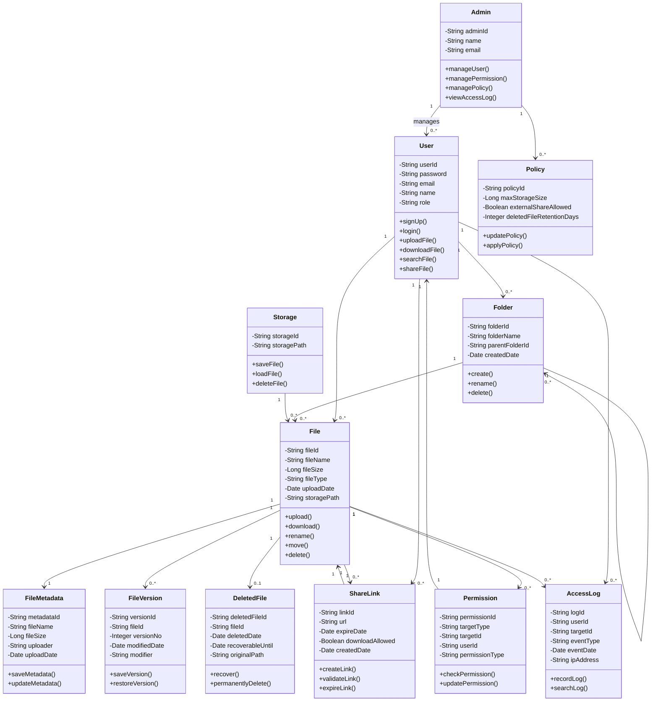
```mermaid
classDiagram
    class User {
        -String userId
        -String password
        -String email
        -String name
        -String role
        +signUp()
        +login()
        +uploadFile()
        +downloadFile()
        +searchFile()
        +shareFile()
    }

    class Admin {
        -String adminId
        -String name
        -String email
        +manageUser()
        +managePermission()
        +managePolicy()
        +viewAccessLog()
    }

    class File {
        -String fileId
        -String fileName
        -Long fileSize
        -String fileType
        -Date uploadDate
        -String storagePath
        +upload()
        +download()
        +rename()
        +move()
        +delete()
    }

    class Folder {
        -String folderId
        -String folderName
        -String parentFolderId
        -Date createdDate
        +create()
        +rename()
        +delete()
    }

    class FileMetadata {
        -String metadataId
        -String fileName
        -Long fileSize
        -String uploader
        -Date uploadDate
        +saveMetadata()
        +updateMetadata()
    }

    class Permission {
        -String permissionId
        -String targetType
        -String targetId
        -String userId
        -String permissionType
        +checkPermission()
        +updatePermission()
    }

    class ShareLink {
        -String linkId
        -String url
        -Date expireDate
        -Boolean downloadAllowed
        -Date createdDate
        +createLink()
        +validateLink()
        +expireLink()
    }

    class FileVersion {
        -String versionId
        -String fileId
        -Integer versionNo
        -Date modifiedDate
        -String modifier
        +saveVersion()
        +restoreVersion()
    }

    class DeletedFile {
        -String deletedFileId
        -String fileId
        -Date deletedDate
        -Date recoverableUntil
        -String originalPath
        +recover()
        +permanentlyDelete()
    }

    class AccessLog {
        -String logId
        -String userId
        -String targetId
        -String eventType
        -Date eventDate
        -String ipAddress
        +recordLog()
        +searchLog()
    }

    class Storage {
        -String storageId
        -String storagePath
        +saveFile()
        +loadFile()
        +deleteFile()
    }

    class Policy {
        -String policyId
        -Long maxStorageSize
        -Boolean externalShareAllowed
        -Integer deletedFileRetentionDays
        +updatePolicy()
        +applyPolicy()
    }

    Admin "1" --> "0..*" User : manages
    User "1" --> "0..*" File
    User "1" --> "0..*" Folder
    User "1" --> "0..*" ShareLink
    User "1" --> "0..*" AccessLog

    Folder "1" --> "0..*" File
    Folder "1" --> "0..*" Folder

    File "1" --> "1" FileMetadata
    File "1" --> "0..*" FileVersion
    File "1" --> "0..*" Permission
    File "1" --> "0..*" ShareLink
    File "1" --> "0..*" AccessLog
    File "1" --> "0..1" DeletedFile

    Permission "1" --> "1" User
    ShareLink "1" --> "1" File
    Storage "1" --> "0..*" File
    Admin "1" --> "0..*" Policy
```

---

## 3.2 CRC 카드

### Class Name: User

| 항목 | 내용 |
|---|---|
| ID | C_01 |
| Type | Concrete, Domain |
| Description | SyncSpace를 사용하는 일반 사용자를 나타낸다. |
| Associated Use Case | U_01, U_02, U_03, U_04, U_05, U_06, U_07, U_08, U_09, U_10 |

| Responsibilities | Collaborators |
|---|---|
| 회원가입 요청 | 데이터베이스 |
| 로그인 요청 | 인증 시스템 |
| 파일 업로드 요청 | File, Storage |
| 파일 다운로드 요청 | File, Storage |
| 파일 검색 요청 | FileMetadata |
| 파일 공유 요청 | Permission, ShareLink |
| 파일 버전 복원 요청 | FileVersion |
| 삭제 파일 복구 요청 | DeletedFile |

**Attributes**

- userId: String
- password: String
- email: String
- name: String
- role: String

**Relationships**

- Generalization: 없음
- Aggregation: File, Folder
- Other Associations: Permission, ShareLink, AccessLog, Admin

---

### Class Name: Admin

| 항목 | 내용 |
|---|---|
| ID | C_02 |
| Type | Concrete, Domain |
| Description | SyncSpace의 사용자, 권한, 정책, 로그를 관리하는 관리자를 나타낸다. |
| Associated Use Case | U_11, U_12 |

| Responsibilities | Collaborators |
|---|---|
| 사용자 목록 조회 | User |
| 사용자 권한 변경 | Permission |
| 저장 공간 정책 설정 | Policy |
| 외부 공유 정책 설정 | Policy, ShareLink |
| 접근 로그 조회 | AccessLog |

**Attributes**

- adminId: String
- name: String
- email: String
- role: String

**Relationships**

- Generalization: 없음
- Aggregation: Policy
- Other Associations: User, Permission, AccessLog

---

### Class Name: File

| 항목 | 내용 |
|---|---|
| ID | C_03 |
| Type | Concrete, Domain |
| Description | 사용자가 SyncSpace에 업로드한 파일을 나타낸다. |
| Associated Use Case | U_03, U_04, U_05, U_06, U_07, U_08, U_09, U_10, U_13 |

| Responsibilities | Collaborators |
|---|---|
| 파일 업로드 | Storage |
| 파일 다운로드 | Storage |
| 파일명 변경 | FileMetadata |
| 파일 이동 | Folder |
| 파일 삭제 | DeletedFile |
| 파일 버전 생성 | FileVersion |
| 파일 권한 확인 | Permission |

**Attributes**

- fileId: String
- fileName: String
- fileSize: Long
- fileType: String
- uploadDate: Date
- storagePath: String

**Relationships**

- Generalization: 없음
- Aggregation: FileMetadata, FileVersion
- Other Associations: Folder, Permission, ShareLink, AccessLog, Storage

---

### Class Name: Folder

| 항목 | 내용 |
|---|---|
| ID | C_04 |
| Type | Concrete, Domain |
| Description | 파일을 계층적으로 분류하고 관리하기 위한 폴더를 나타낸다. |
| Associated Use Case | U_05, U_06 |

| Responsibilities | Collaborators |
|---|---|
| 폴더 생성 | User |
| 폴더명 수정 | User |
| 폴더 삭제 | User |
| 파일 포함 | File |
| 하위 폴더 포함 | Folder |

**Attributes**

- folderId: String
- folderName: String
- parentFolderId: String
- createdDate: Date

**Relationships**

- Generalization: 없음
- Aggregation: File, Folder
- Other Associations: User, Permission

---

### Class Name: FileMetadata

| 항목 | 내용 |
|---|---|
| ID | C_05 |
| Type | Concrete, Domain |
| Description | 파일명, 크기, 유형, 업로더, 업로드 일시 등 파일의 부가 정보를 나타낸다. |
| Associated Use Case | U_03, U_06 |

| Responsibilities | Collaborators |
|---|---|
| 파일 메타데이터 저장 | File |
| 파일 메타데이터 조회 | 데이터베이스 |
| 파일 검색 조건 제공 | User |
| 파일 위치 정보 제공 | Folder |

**Attributes**

- metadataId: String
- fileName: String
- fileSize: Long
- fileType: String
- uploader: String
- uploadDate: Date
- folderPath: String

**Relationships**

- Generalization: 없음
- Aggregation: File
- Other Associations: Folder, User

---

### Class Name: Permission

| 항목 | 내용 |
|---|---|
| ID | C_06 |
| Type | Concrete, Domain |
| Description | 사용자별 파일 또는 폴더 접근 권한을 나타낸다. |
| Associated Use Case | U_04, U_05, U_06, U_07, U_08, U_09, U_10, U_11 |

| Responsibilities | Collaborators |
|---|---|
| 파일 접근 권한 확인 | User, File |
| 폴더 접근 권한 확인 | User, Folder |
| 공유 권한 설정 | Admin |
| 권한 변경 | Admin |
| 권한 없는 접근 차단 | 인증 시스템 |

**Attributes**

- permissionId: String
- targetType: String
- targetId: String
- userId: String
- permissionType: String

**Relationships**

- Generalization: 없음
- Aggregation: 없음
- Other Associations: User, Admin, File, Folder

---

### Class Name: ShareLink

| 항목 | 내용 |
|---|---|
| ID | C_07 |
| Type | Concrete, Domain |
| Description | 외부 사용자가 파일에 접근할 수 있도록 생성되는 공유 링크를 나타낸다. |
| Associated Use Case | U_08, U_13 |

| Responsibilities | Collaborators |
|---|---|
| 외부 링크 생성 | User |
| 링크 만료 기간 설정 | User |
| 다운로드 허용 여부 설정 | User |
| 링크 유효성 검증 | 외부 사용자 |
| 만료 링크 차단 | Policy |
| 외부 링크 접근 처리 | File, Storage |

**Attributes**

- linkId: String
- url: String
- expireDate: Date
- downloadAllowed: Boolean
- createdDate: Date

**Relationships**

- Generalization: 없음
- Aggregation: File
- Other Associations: User, ExternalUser, Policy, AccessLog

---

### Class Name: FileVersion

| 항목 | 내용 |
|---|---|
| ID | C_08 |
| Type | Concrete, Domain |
| Description | 파일의 수정 이력과 이전 버전 정보를 나타낸다. |
| Associated Use Case | U_09 |

| Responsibilities | Collaborators |
|---|---|
| 파일 버전 저장 | File |
| 버전 목록 제공 | User |
| 이전 버전 다운로드 | Storage |
| 이전 버전 복원 | File |

**Attributes**

- versionId: String
- fileId: String
- versionNo: Integer
- modifiedDate: Date
- modifier: String
- versionPath: String

**Relationships**

- Generalization: 없음
- Aggregation: File
- Other Associations: User, Storage

---

### Class Name: DeletedFile

| 항목 | 내용 |
|---|---|
| ID | C_09 |
| Type | Concrete, Domain |
| Description | 삭제되었지만 일정 기간 동안 복구 가능한 파일을 나타낸다. |
| Associated Use Case | U_10 |

| Responsibilities | Collaborators |
|---|---|
| 삭제 파일 목록 제공 | User |
| 복구 가능 기간 확인 | Policy |
| 삭제 파일 복구 | File, Storage |
| 복구 불가 파일 처리 | Storage |

**Attributes**

- deletedFileId: String
- fileId: String
- deletedDate: Date
- recoverableUntil: Date
- originalPath: String

**Relationships**

- Generalization: 없음
- Aggregation: File
- Other Associations: User, Storage, Policy

---

### Class Name: AccessLog

| 항목 | 내용 |
|---|---|
| ID | C_10 |
| Type | Concrete, Domain |
| Description | 파일 접근, 다운로드, 공유, 권한 변경 등 주요 이벤트 기록을 나타낸다. |
| Associated Use Case | U_04, U_07, U_08, U_11, U_12, U_13 |

| Responsibilities | Collaborators |
|---|---|
| 접근 로그 기록 | User |
| 다운로드 로그 기록 | File |
| 공유 로그 기록 | ShareLink |
| 권한 변경 로그 기록 | Admin |
| 외부 링크 접근 로그 기록 | ExternalUser |
| 로그 조회 | Admin |

**Attributes**

- logId: String
- userId: String
- targetId: String
- eventType: String
- eventDate: Date
- ipAddress: String

**Relationships**

- Generalization: 없음
- Aggregation: 없음
- Other Associations: User, Admin, File, ShareLink

---

### Class Name: Storage

| 항목 | 내용 |
|---|---|
| ID | C_11 |
| Type | Concrete, Domain |
| Description | 실제 파일 원본을 저장하고 제공하는 저장소를 나타낸다. |
| Associated Use Case | U_03, U_04, U_09, U_10, U_13 |

| Responsibilities | Collaborators |
|---|---|
| 파일 원본 저장 | File |
| 파일 원본 조회 | File |
| 파일 원본 삭제 | File |
| 이전 버전 파일 제공 | FileVersion |
| 외부 링크 접근 파일 제공 | ShareLink |

**Attributes**

- storageId: String
- storagePath: String
- capacity: Long

**Relationships**

- Generalization: 없음
- Aggregation: File
- Other Associations: FileVersion, DeletedFile, ShareLink

---

### Class Name: Policy

| 항목 | 내용 |
|---|---|
| ID | C_12 |
| Type | Concrete, Domain |
| Description | 저장 공간, 외부 공유, 삭제 파일 보관 기간 등 시스템 운영 정책을 나타낸다. |
| Associated Use Case | U_03, U_08, U_10, U_11, U_13 |

| Responsibilities | Collaborators |
|---|---|
| 저장 공간 정책 확인 | File |
| 외부 공유 정책 확인 | ShareLink |
| 삭제 파일 보관 기간 확인 | DeletedFile |
| 정책 변경 | Admin |

**Attributes**

- policyId: String
- maxStorageSize: Long
- externalShareAllowed: Boolean
- deletedFileRetentionDays: Integer

**Relationships**

- Generalization: 없음
- Aggregation: 없음
- Other Associations: Admin, File, ShareLink, DeletedFile

---

## 3.3 동적 분석

동적 분석에서는 주요 유스케이스가 실행될 때 객체들이 어떤 순서로 상호작용하는지 분석한다. 기본 흐름은 정상 시나리오를 중심으로 작성하되, 로그인 실패, 권한 없음, 정책 위반, 만료 링크 접근 등 주요 예외 흐름은 `alt` 블록으로 함께 표현한다.

---

### 3.3.1 회원가입을 한다

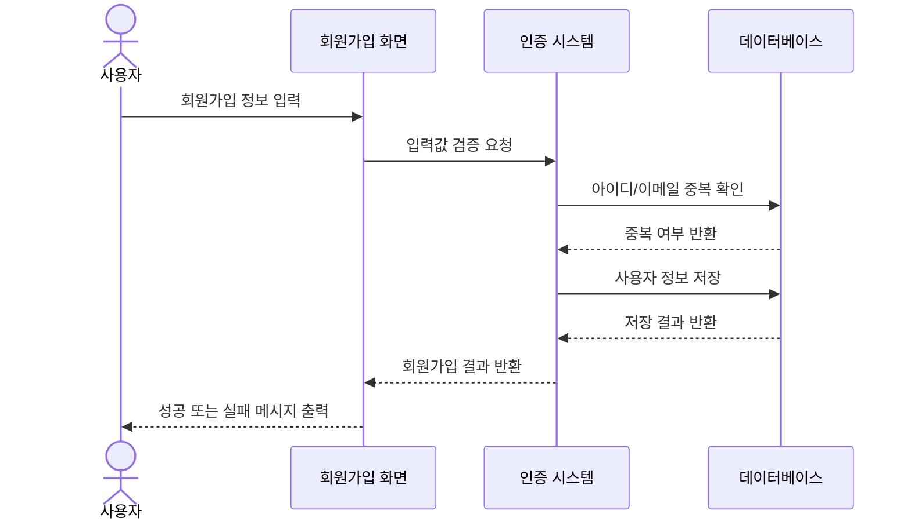
```mermaid
sequenceDiagram
    actor User as 사용자
    participant UI as 회원가입 화면
    participant Auth as 인증 시스템
    participant DB as 데이터베이스

    User->>UI: 회원가입 정보 입력
    UI->>Auth: 입력값 검증 요청
    Auth->>DB: 아이디/이메일 중복 확인
    DB-->>Auth: 중복 여부 반환
    Auth->>DB: 사용자 정보 저장
    DB-->>Auth: 저장 결과 반환
    Auth-->>UI: 회원가입 결과 반환
    UI-->>User: 성공 또는 실패 메시지 출력
```

---

### 3.3.2 로그인을 한다

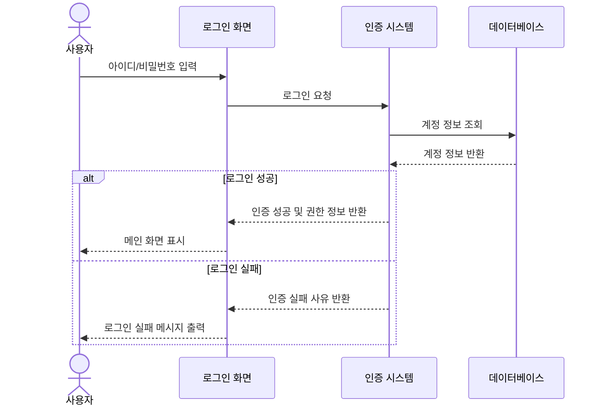
```mermaid
sequenceDiagram
    actor User as 사용자
    participant UI as 로그인 화면
    participant Auth as 인증 시스템
    participant DB as 데이터베이스

    User->>UI: 아이디/비밀번호 입력
    UI->>Auth: 로그인 요청
    Auth->>DB: 계정 정보 조회
    DB-->>Auth: 계정 정보 반환

    alt 로그인 성공
        Auth-->>UI: 인증 성공 및 권한 정보 반환
        UI-->>User: 메인 화면 표시
    else 로그인 실패
        Auth-->>UI: 인증 실패 사유 반환
        UI-->>User: 로그인 실패 메시지 출력
    end
```

---

### 3.3.3 파일을 업로드한다

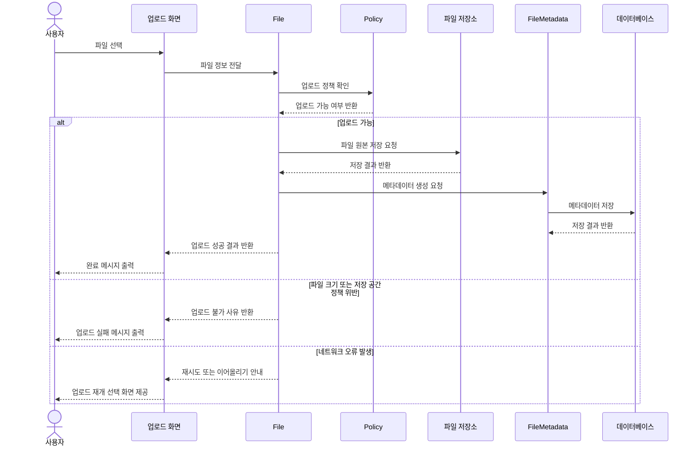
```mermaid
sequenceDiagram
    actor User as 사용자
    participant UI as 업로드 화면
    participant File as File
    participant Policy as Policy
    participant Storage as 파일 저장소
    participant Meta as FileMetadata
    participant DB as 데이터베이스

    User->>UI: 파일 선택
    UI->>File: 파일 정보 전달
    File->>Policy: 업로드 정책 확인
    Policy-->>File: 업로드 가능 여부 반환

    alt 업로드 가능
        File->>Storage: 파일 원본 저장 요청
        Storage-->>File: 저장 결과 반환
        File->>Meta: 메타데이터 생성 요청
        Meta->>DB: 메타데이터 저장
        DB-->>Meta: 저장 결과 반환
        File-->>UI: 업로드 성공 결과 반환
        UI-->>User: 완료 메시지 출력
    else 파일 크기 또는 저장 공간 정책 위반
        File-->>UI: 업로드 불가 사유 반환
        UI-->>User: 업로드 실패 메시지 출력
    else 네트워크 오류 발생
        File-->>UI: 재시도 또는 이어올리기 안내
        UI-->>User: 업로드 재개 선택 화면 제공
    end
```

---

### 3.3.4 파일을 다운로드한다

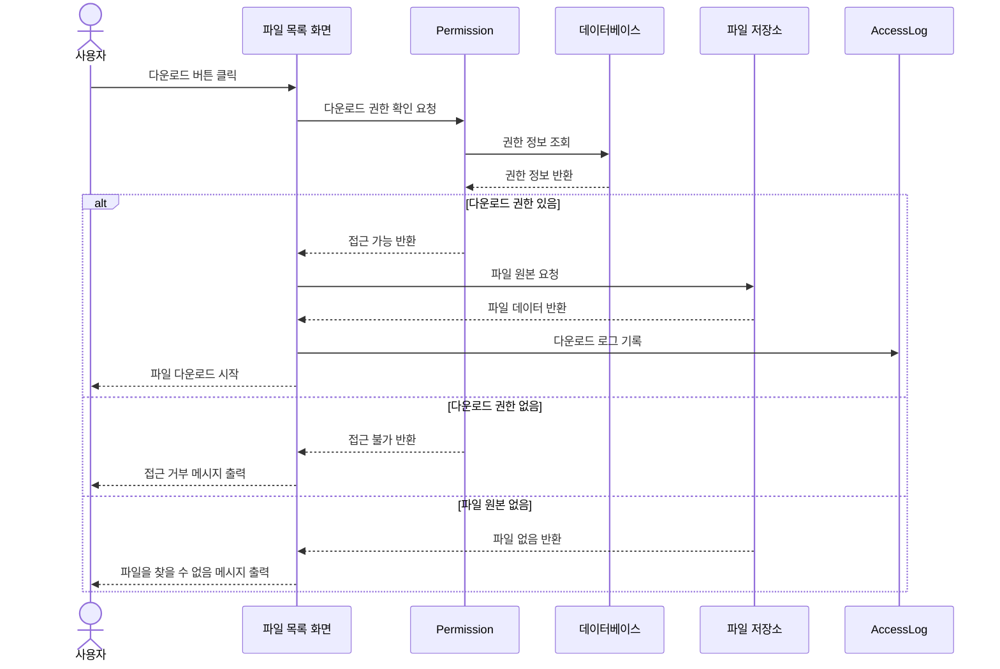
```mermaid
sequenceDiagram
    actor User as 사용자
    participant UI as 파일 목록 화면
    participant Permission as Permission
    participant DB as 데이터베이스
    participant Storage as 파일 저장소
    participant Log as AccessLog

    User->>UI: 다운로드 버튼 클릭
    UI->>Permission: 다운로드 권한 확인 요청
    Permission->>DB: 권한 정보 조회
    DB-->>Permission: 권한 정보 반환

    alt 다운로드 권한 있음
        Permission-->>UI: 접근 가능 반환
        UI->>Storage: 파일 원본 요청
        Storage-->>UI: 파일 데이터 반환
        UI->>Log: 다운로드 로그 기록
        UI-->>User: 파일 다운로드 시작
    else 다운로드 권한 없음
        Permission-->>UI: 접근 불가 반환
        UI-->>User: 접근 거부 메시지 출력
    else 파일 원본 없음
        Storage-->>UI: 파일 없음 반환
        UI-->>User: 파일을 찾을 수 없음 메시지 출력
    end
```

---

### 3.3.5 파일을 검색한다

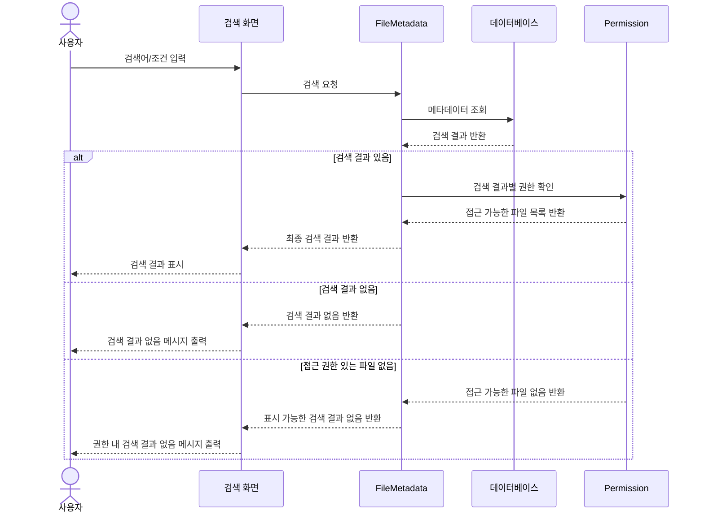
```mermaid
sequenceDiagram
    actor User as 사용자
    participant UI as 검색 화면
    participant Meta as FileMetadata
    participant DB as 데이터베이스
    participant Permission as Permission

    User->>UI: 검색어/조건 입력
    UI->>Meta: 검색 요청
    Meta->>DB: 메타데이터 조회
    DB-->>Meta: 검색 결과 반환

    alt 검색 결과 있음
        Meta->>Permission: 검색 결과별 권한 확인
        Permission-->>Meta: 접근 가능한 파일 목록 반환
        Meta-->>UI: 최종 검색 결과 반환
        UI-->>User: 검색 결과 표시
    else 검색 결과 없음
        Meta-->>UI: 검색 결과 없음 반환
        UI-->>User: 검색 결과 없음 메시지 출력
    else 접근 권한 있는 파일 없음
        Permission-->>Meta: 접근 가능한 파일 없음 반환
        Meta-->>UI: 표시 가능한 검색 결과 없음 반환
        UI-->>User: 권한 내 검색 결과 없음 메시지 출력
    end
```

---

### 3.3.6 내부 사용자에게 공유한다

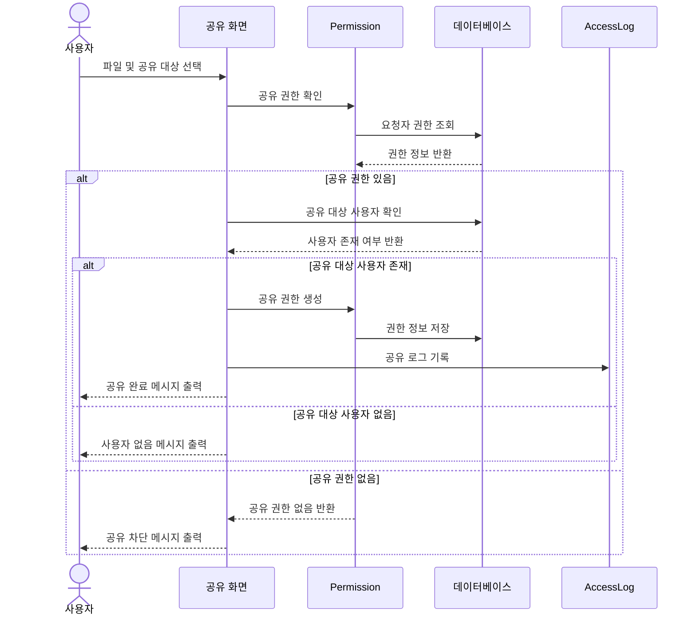
```mermaid
sequenceDiagram
    actor User as 사용자
    participant UI as 공유 화면
    participant Permission as Permission
    participant DB as 데이터베이스
    participant Log as AccessLog

    User->>UI: 파일 및 공유 대상 선택
    UI->>Permission: 공유 권한 확인
    Permission->>DB: 요청자 권한 조회
    DB-->>Permission: 권한 정보 반환

    alt 공유 권한 있음
        UI->>DB: 공유 대상 사용자 확인
        DB-->>UI: 사용자 존재 여부 반환
        alt 공유 대상 사용자 존재
            UI->>Permission: 공유 권한 생성
            Permission->>DB: 권한 정보 저장
            UI->>Log: 공유 로그 기록
            UI-->>User: 공유 완료 메시지 출력
        else 공유 대상 사용자 없음
            UI-->>User: 사용자 없음 메시지 출력
        end
    else 공유 권한 없음
        Permission-->>UI: 공유 권한 없음 반환
        UI-->>User: 공유 차단 메시지 출력
    end
```

---

### 3.3.7 외부 링크를 생성한다

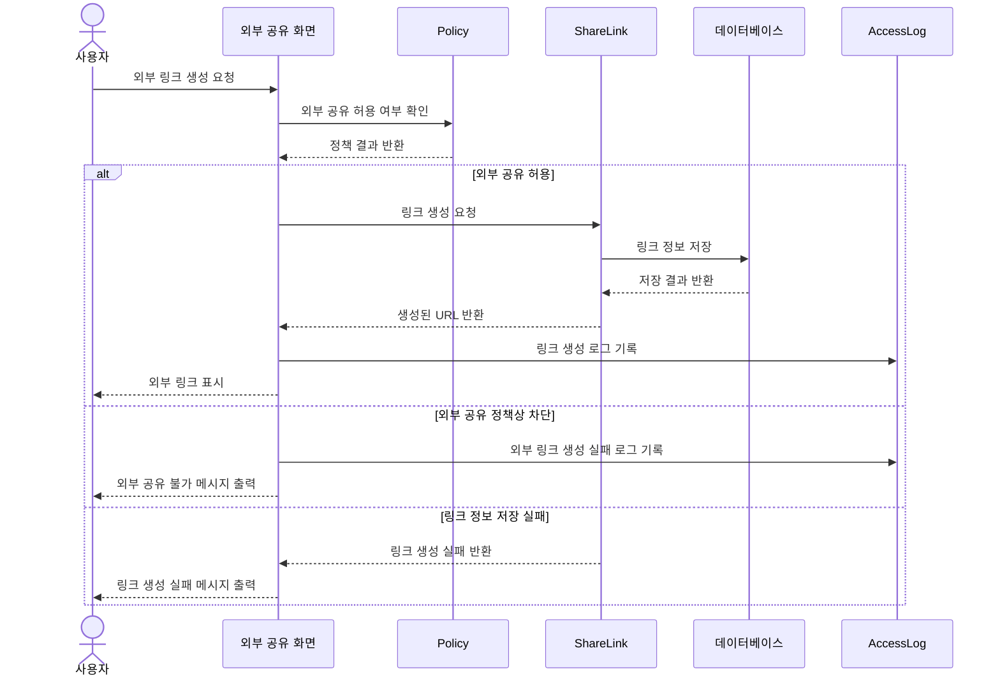
```mermaid
sequenceDiagram
    actor User as 사용자
    participant UI as 외부 공유 화면
    participant Policy as Policy
    participant Share as ShareLink
    participant DB as 데이터베이스
    participant Log as AccessLog

    User->>UI: 외부 링크 생성 요청
    UI->>Policy: 외부 공유 허용 여부 확인
    Policy-->>UI: 정책 결과 반환

    alt 외부 공유 허용
        UI->>Share: 링크 생성 요청
        Share->>DB: 링크 정보 저장
        DB-->>Share: 저장 결과 반환
        Share-->>UI: 생성된 URL 반환
        UI->>Log: 링크 생성 로그 기록
        UI-->>User: 외부 링크 표시
    else 외부 공유 정책상 차단
        UI->>Log: 외부 링크 생성 실패 로그 기록
        UI-->>User: 외부 공유 불가 메시지 출력
    else 링크 정보 저장 실패
        Share-->>UI: 링크 생성 실패 반환
        UI-->>User: 링크 생성 실패 메시지 출력
    end
```

---

### 3.3.8 파일 버전을 확인하고 복원한다

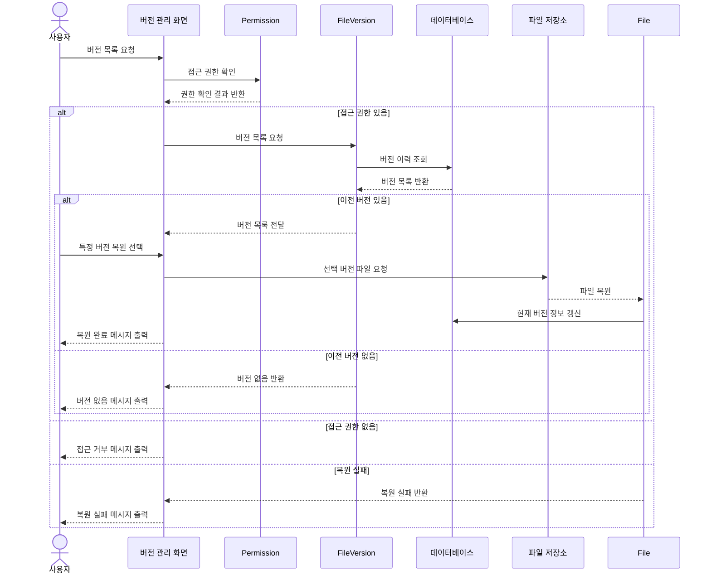
```mermaid
sequenceDiagram
    actor User as 사용자
    participant UI as 버전 관리 화면
    participant Permission as Permission
    participant Version as FileVersion
    participant DB as 데이터베이스
    participant Storage as 파일 저장소
    participant File as File

    User->>UI: 버전 목록 요청
    UI->>Permission: 접근 권한 확인
    Permission-->>UI: 권한 확인 결과 반환

    alt 접근 권한 있음
        UI->>Version: 버전 목록 요청
        Version->>DB: 버전 이력 조회
        DB-->>Version: 버전 목록 반환
        alt 이전 버전 있음
            Version-->>UI: 버전 목록 전달
            User->>UI: 특정 버전 복원 선택
            UI->>Storage: 선택 버전 파일 요청
            Storage-->>File: 파일 복원
            File->>DB: 현재 버전 정보 갱신
            UI-->>User: 복원 완료 메시지 출력
        else 이전 버전 없음
            Version-->>UI: 버전 없음 반환
            UI-->>User: 버전 없음 메시지 출력
        end
    else 접근 권한 없음
        UI-->>User: 접근 거부 메시지 출력
    else 복원 실패
        File-->>UI: 복원 실패 반환
        UI-->>User: 복원 실패 메시지 출력
    end
```

---

### 3.3.9 삭제 파일을 복구한다

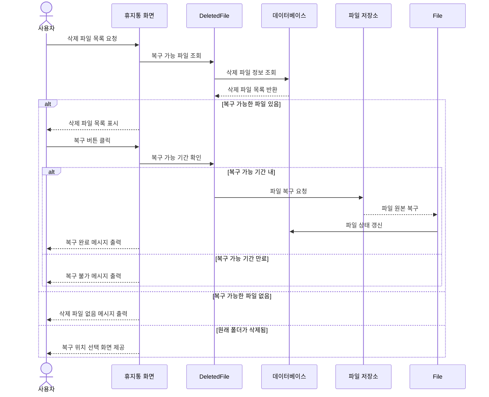
```mermaid
sequenceDiagram
    actor User as 사용자
    participant UI as 휴지통 화면
    participant Deleted as DeletedFile
    participant DB as 데이터베이스
    participant Storage as 파일 저장소
    participant File as File

    User->>UI: 삭제 파일 목록 요청
    UI->>Deleted: 복구 가능 파일 조회
    Deleted->>DB: 삭제 파일 정보 조회
    DB-->>Deleted: 삭제 파일 목록 반환

    alt 복구 가능한 파일 있음
        UI-->>User: 삭제 파일 목록 표시
        User->>UI: 복구 버튼 클릭
        UI->>Deleted: 복구 가능 기간 확인
        alt 복구 가능 기간 내
            Deleted->>Storage: 파일 복구 요청
            Storage-->>File: 파일 원본 복구
            File->>DB: 파일 상태 갱신
            UI-->>User: 복구 완료 메시지 출력
        else 복구 가능 기간 만료
            UI-->>User: 복구 불가 메시지 출력
        end
    else 복구 가능한 파일 없음
        UI-->>User: 삭제 파일 없음 메시지 출력
    else 원래 폴더가 삭제됨
        UI-->>User: 복구 위치 선택 화면 제공
    end
```

---

### 3.3.10 접근 로그를 확인한다

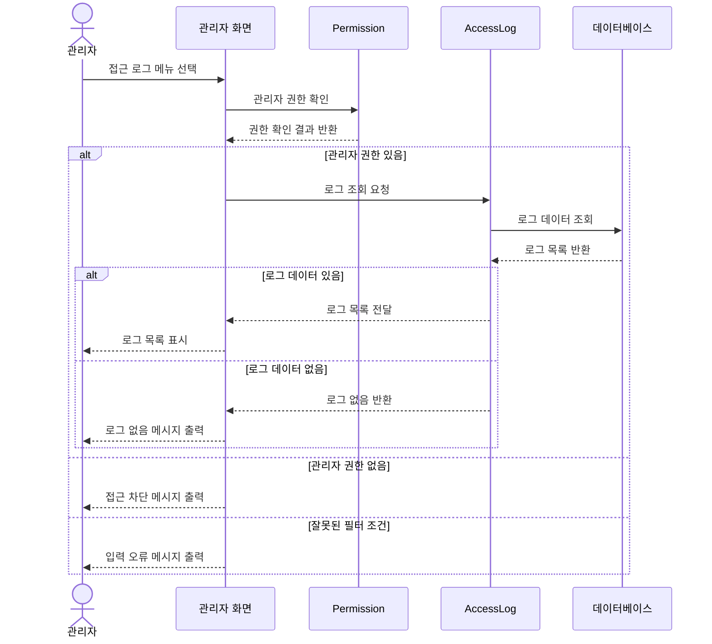
```mermaid
sequenceDiagram
    actor Admin as 관리자
    participant UI as 관리자 화면
    participant Permission as Permission
    participant Log as AccessLog
    participant DB as 데이터베이스

    Admin->>UI: 접근 로그 메뉴 선택
    UI->>Permission: 관리자 권한 확인
    Permission-->>UI: 권한 확인 결과 반환

    alt 관리자 권한 있음
        UI->>Log: 로그 조회 요청
        Log->>DB: 로그 데이터 조회
        DB-->>Log: 로그 목록 반환
        alt 로그 데이터 있음
            Log-->>UI: 로그 목록 전달
            UI-->>Admin: 로그 목록 표시
        else 로그 데이터 없음
            Log-->>UI: 로그 없음 반환
            UI-->>Admin: 로그 없음 메시지 출력
        end
    else 관리자 권한 없음
        UI-->>Admin: 접근 차단 메시지 출력
    else 잘못된 필터 조건
        UI-->>Admin: 입력 오류 메시지 출력
    end
```

---

### 3.3.11 외부 링크로 파일에 접근한다

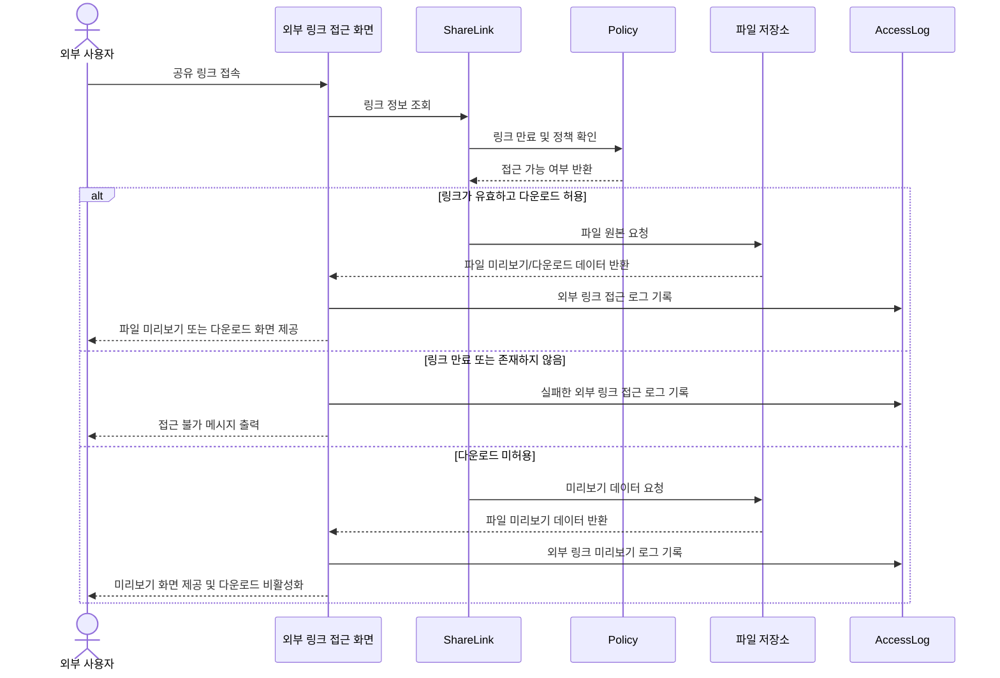
```mermaid
sequenceDiagram
    actor ExternalUser as 외부 사용자
    participant LinkUI as 외부 링크 접근 화면
    participant Share as ShareLink
    participant Policy as Policy
    participant Storage as 파일 저장소
    participant Log as AccessLog

    ExternalUser->>LinkUI: 공유 링크 접속
    LinkUI->>Share: 링크 정보 조회
    Share->>Policy: 링크 만료 및 정책 확인
    Policy-->>Share: 접근 가능 여부 반환

    alt 링크가 유효하고 다운로드 허용
        Share->>Storage: 파일 원본 요청
        Storage-->>LinkUI: 파일 미리보기/다운로드 데이터 반환
        LinkUI->>Log: 외부 링크 접근 로그 기록
        LinkUI-->>ExternalUser: 파일 미리보기 또는 다운로드 화면 제공
    else 링크 만료 또는 존재하지 않음
        LinkUI->>Log: 실패한 외부 링크 접근 로그 기록
        LinkUI-->>ExternalUser: 접근 불가 메시지 출력
    else 다운로드 미허용
        Share->>Storage: 미리보기 데이터 요청
        Storage-->>LinkUI: 파일 미리보기 데이터 반환
        LinkUI->>Log: 외부 링크 미리보기 로그 기록
        LinkUI-->>ExternalUser: 미리보기 화면 제공 및 다운로드 비활성화
    end
```

---

# 4. 인터페이스 분석

## 4.1 사용자 인터페이스

| 인터페이스 | 설명 |
|---|---|
| 회원가입 화면 | 사용자가 아이디, 비밀번호, 이메일 주소를 입력하여 계정을 생성하는 화면 |
| 로그인 화면 | 사용자가 계정 정보를 입력하여 시스템에 접속하는 화면 |
| 메인 화면 | 사용자의 파일 목록, 최근 파일, 공유 파일, 검색창을 제공하는 화면 |
| 파일 업로드 화면 | 파일 선택, 업로드 버튼, 업로드 진행률을 제공하는 화면 |
| 파일 목록 화면 | 업로드된 파일의 파일명, 유형, 크기, 업로더, 업로드 날짜를 보여주는 화면 |
| 폴더 관리 화면 | 폴더 생성, 이름 변경, 삭제, 파일 이동 기능을 제공하는 화면 |
| 검색 화면 | 파일명, 유형, 업로드 날짜, 업로더 기준 검색 기능을 제공하는 화면 |
| 공유 설정 화면 | 내부 사용자 공유, 권한 설정, 외부 링크 생성 기능을 제공하는 화면 |
| 외부 링크 접근 화면 | 외부 사용자가 공유 링크를 통해 파일 미리보기 또는 다운로드를 수행하는 화면 |
| 버전 관리 화면 | 파일의 이전 버전 목록, 다운로드, 복원 기능을 제공하는 화면 |
| 휴지통 화면 | 삭제된 파일 목록과 복구 기능을 제공하는 화면 |
| 관리자 화면 | 사용자, 권한, 저장 공간, 공유 정책, 접근 로그를 관리하는 화면 |

---

## 4.2 시스템 인터페이스

| 인터페이스 | 설명 |
|---|---|
| 인증 시스템 인터페이스 | 로그인, 세션 관리, 권한 확인을 처리한다. |
| 데이터베이스 인터페이스 | 사용자 정보, 파일 메타데이터, 권한 정보, 버전 이력, 접근 로그를 저장하고 조회한다. |
| 파일 저장소 인터페이스 | 업로드된 파일 원본을 저장하고 다운로드 요청 시 파일을 제공한다. |
| 외부 링크 검증 인터페이스 | 외부 링크의 유효성, 만료 기간, 다운로드 허용 여부를 확인한다. |
| 로그 관리 인터페이스 | 파일 접근, 다운로드, 공유, 권한 변경 이벤트를 기록하고 조회한다. |

---

# 5. 제약사항

| 구분 | 제약사항 |
|---|---|
| 운영 환경 | 시스템은 웹 브라우저 기반으로 동작해야 한다. |
| 네트워크 | 파일 업로드, 다운로드, 검색, 공유 기능은 네트워크 연결이 필요하다. |
| 보안 | 로그인하지 않은 사용자는 주요 기능에 접근할 수 없다. |
| 권한 | 사용자는 자신에게 권한이 부여된 파일과 폴더에만 접근할 수 있다. |
| 외부 공유 | 외부 링크는 만료 기간과 다운로드 허용 여부에 따라 접근이 제한되어야 한다. |
| 저장 공간 | 사용자는 관리자 정책에 따라 제한된 저장 공간 내에서 파일을 업로드해야 한다. |
| 대용량 업로드 | 100MB 이상의 파일 업로드 시 진행률 표시와 재시도 또는 이어올리기 기능을 고려해야 한다. |
| 복구 기간 | 삭제된 파일은 정책상 정해진 기간 내에서만 복구 가능하다. |
| 브라우저 호환성 | Windows 또는 Linux 환경의 주요 웹 브라우저에서 접근 가능해야 한다. |
| 개인정보 | 사용자 계정 정보와 인증 정보는 안전하게 저장되어야 한다. |

---

# 6. 요구사항 추적표

| 요구사항 ID | 요구사항 내용 요약 | 관련 Use Case |
|---|---|---|
| FR-001 | 회원가입 기능 | U_01 |
| FR-002 | 로그인 기능 | U_02 |
| FR-003 | 로그인 사용자만 주요 기능 접근 | U_02 |
| FR-004 | 사용자 계정 정보 확인 | U_01, U_02 |
| FR-005 | 관리자 사용자 계정 조회 | U_11 |
| FR-006 | 다양한 유형의 파일 업로드 | U_03 |
| FR-007 | 업로드된 파일 다운로드 | U_04 |
| FR-008 | 파일 메타데이터 저장 | U_03, U_06 |
| FR-009 | 대용량 파일 업로드 지원 | U_03 |
| FR-010 | 업로드 진행 상태 확인 | U_03 |
| FR-011 | 업로드 재시도 또는 이어올리기 | U_03 |
| FR-012 | 폴더 생성 | U_05 |
| FR-013 | 폴더 이름 수정 | U_05 |
| FR-014 | 폴더 삭제 | U_05 |
| FR-015 | 파일 폴더 간 이동 | U_05 |
| FR-016 | 파일명 변경 | U_05 |
| FR-017 | 다단계 폴더 구조 지원 | U_05 |
| FR-018 | 파일명 기준 검색 | U_06 |
| FR-019 | 파일 유형 기준 검색 | U_06 |
| FR-020 | 업로드 날짜 기준 검색 | U_06 |
| FR-021 | 업로더 기준 검색 | U_06 |
| FR-022 | 검색 결과 목록 제공 | U_06 |
| FR-023 | 검색 결과에서 파일 위치와 기본 정보 확인 | U_06 |
| FR-024 | 내부 사용자에게 파일 또는 폴더 공유 | U_07 |
| FR-025 | 보기, 수정 권한 구분 | U_07, U_11 |
| FR-026 | 외부 링크 생성 | U_08 |
| FR-027 | 외부 링크 만료 기간 설정 | U_08, U_13 |
| FR-028 | 외부 링크 다운로드 허용 여부 설정 | U_08, U_13 |
| FR-029 | 만료된 외부 링크 접근 차단 | U_13 |
| FR-030 | 파일 수정 이력 기반 버전 저장 | U_09 |
| FR-031 | 이전 버전 목록 확인 | U_09 |
| FR-032 | 이전 버전 다운로드 | U_09 |
| FR-033 | 이전 버전으로 복원 | U_09 |
| FR-034 | 삭제 파일 일정 기간 복구 | U_10 |
| FR-035 | 사용자 권한 설정 및 변경 | U_11 |
| FR-036 | 저장 공간 및 공유 정책 관리 | U_11 |
| FR-037 | 외부 링크 공유 정책 통제 | U_08, U_11, U_13 |
| FR-038 | 권한 없는 사용자 접근 차단 | U_02, U_04, U_05, U_06, U_07, U_08, U_09, U_10, U_13 |
| FR-039 | 파일 접근 및 공유 로그 기록 | U_04, U_07, U_08, U_11, U_12, U_13 |
| NFR-004 | 검색 결과 2초 이내 표시 | U_06 |
| NFR-005 | 다운로드 요청 후 3초 이내 전송 시작 | U_04, U_13 |
| NFR-007 | 대용량 업로드 진행률 1초 이내 갱신 | U_03 |
| NFR-008 | 업로드 성공률 99% 이상 목표 | U_03 |
| NFR-009 | 삭제 파일 30일 이내 복구 가능 | U_10 |
| NFR-010 | 이전 버전 복원 성공률 95% 이상 | U_09 |
| NFR-012 | 권한 없는 사용자 접근 성공률 0% | U_02, U_04, U_05, U_06, U_07, U_08, U_09, U_10, U_13 |
| NFR-013 | 외부 공유 링크 100% 만료 처리 | U_08, U_13 |
| IR-001 | 웹 브라우저 기반 UI 제공 | U_01~U_13 |
| IR-003 | 업로드 진행률 표시 UI 제공 | U_03 |
| IR-004 | 검색 결과 목록 UI 제공 | U_06 |
| IR-006 | 관리자 전용 UI 제공 | U_11, U_12 |
| IR-007 | 데이터베이스 연동 | U_01~U_13 |
| IR-009 | 외부 링크 URL 생성 및 검증 | U_08, U_13 |
| IR-010 | 업로드, 다운로드, 검색, 공유 서버 인터페이스 | U_03, U_04, U_06, U_07, U_08, U_13 |

---

# 7. 참고문헌 및 부록

## 7.1 참고문헌

1. `doc/proposal.md` - SyncSpace 프로젝트 제안서
2. `doc/project2.md` - 품질 요소 추정서
3. `doc/project_plan.md` - 프로젝트 관리 계획서
4. `doc/requirements.md` - 요구사항 정의서
5. `README.md` - 프로젝트 저장소 안내 문서
6. `샘플_요구사항분석서.pdf`
7. `ch08_객체지향 분석.pdf`

---

## 7.2 부록

본 문서의 유스케이스 설명서, CRC 카드, 정적 분석, 동적 분석은 요구사항 정의서에 작성된 기능적 요구사항, 비기능적 요구사항, 인터페이스 요구사항을 기반으로 작성하였다.

향후 소프트웨어 설계서 작성 시 본 문서에서 도출한 클래스, 책임, 객체 간 관계, 순차 흐름을 기준으로 상세 설계를 진행한다.
