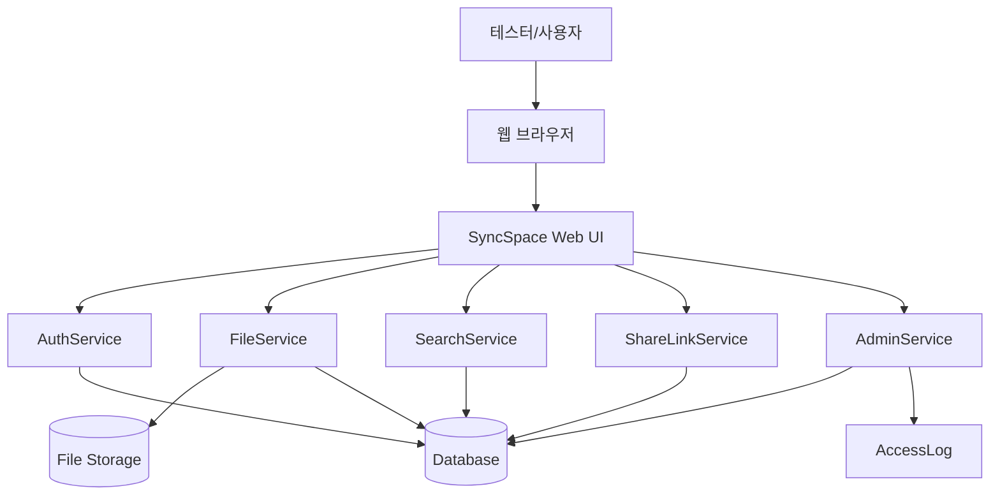

# SyncSpace 테스트 결과 보고서

문서번호 : `[SyncSpace]테스트결과보고서_20260611_Doc-001`  
소 속 : 한국항공대학교  
팀 명 : SyncSpace  
팀 원 : 최민서  
교 수 : 오명원 교수님  
작성일 : 2026년 6월 11일  

---

## 제/개정 이력

| 버전 | 날짜 | 작성자 | 제/개정사항 | 비고 |
|---|---|---|---|---|
| 1.0 | 2026-06-11 | 최민서 | SyncSpace 테스트 결과 보고서 최초 작성 | 제정 |
| 1.1 | 2026-06-11 | 최민서 | 테스트 결과 상태 표현, 외부 링크 테스트 요구사항, 삭제 파일 복구 예외 흐름, 결함/위험 요소 항목 보완 | 수정 |
| 1.2 | 2026-06-11 | 최민서 | 테스트 결과 상태 정의 일관성 보완 및 테스트 디자인 상세 항목 추가 | 수정 |

---

## 목차

1. [서론](#1-서론)  
   1.1 [문서 목적 및 범위](#11-문서-목적-및-범위)  
   1.2 [프로젝트 개요](#12-프로젝트-개요)  
   1.3 [용어 정의](#13-용어-정의)  
   1.4 [참조 문서](#14-참조-문서)  
2. [테스트 개요](#2-테스트-개요)  
   2.1 [테스트 수행 방식](#21-테스트-수행-방식)  
   2.2 [테스트 범위](#22-테스트-범위)  
   2.3 [테스트 항목 및 통과 기준](#23-테스트-항목-및-통과-기준)  
   2.4 [테스트 결과 상태 정의](#24-테스트-결과-상태-정의)  
3. [테스트 케이스](#3-테스트-케이스)  
   3.1 [테스트 케이스 선정 기준](#31-테스트-케이스-선정-기준)  
   3.2 [테스트 케이스 유형](#32-테스트-케이스-유형)  
   3.3 [테스트 케이스 목록](#33-테스트-케이스-목록)  
   3.4 [테스트 디자인 상세](#34-테스트-디자인-상세)  
4. [테스트 예외사항](#4-테스트-예외사항)  
   4.1 [중단 기준과 재개 조건](#41-중단-기준과-재개-조건)  
   4.2 [결함 처리 기준](#42-결함-처리-기준)  
5. [테스트 환경](#5-테스트-환경)  
   5.1 [테스트 환경 구성도](#51-테스트-환경-구성도)  
   5.2 [테스트 데이터](#52-테스트-데이터)  
6. [테스트 결과](#6-테스트-결과)  
   6.1 [테스트 결과 요약](#61-테스트-결과-요약)  
   6.2 [기능별 테스트 결과](#62-기능별-테스트-결과)  
   6.3 [비기능 테스트 결과](#63-비기능-테스트-결과)  
   6.4 [결함, 위험 요소 및 보완 사항](#64-결함-위험-요소-및-보완-사항)  
7. [부록](#7-부록)  
   7.1 [요구사항 추적표](#71-요구사항-추적표)  
   7.2 [리뷰 반영 계획](#72-리뷰-반영-계획)  

---

# 1. 서론

## 1.1 문서 목적 및 범위

본 문서는 **SyncSpace(조직 내부용 클라우드 파일 공유 시스템)** 프로젝트에 대한 테스트 기준, 테스트 범위, 테스트 케이스, 테스트 결과를 정리하기 위한 문서이다.

SyncSpace는 조직 내부에서 발생하는 파일 분산 관리, 최신 버전 혼선, 외부 공유 보안 문제, 대용량 파일 업로드 실패, 권한 관리의 어려움을 해결하기 위한 웹 기반 파일 공유 시스템이다. 본 테스트 결과 보고서는 요구사항 정의서와 요구사항 분석서에 명시된 기능적 요구사항, 비기능적 요구사항, 인터페이스 요구사항을 기준으로 테스트 케이스를 설계하고, 기능별 예상 동작과 결과를 검증하는 것을 목적으로 한다.

본 문서의 범위는 다음과 같다.

1. SyncSpace의 주요 기능별 테스트 범위를 정의한다.
2. 기능별/비기능별 테스트 항목과 통과 기준을 명시한다.
3. 요구사항 기반 테스트 케이스를 설계한다.
4. 테스트 디자인 전략, 입력값 분류, 정상/예외 흐름, 추적 기준을 정리한다.
5. 테스트 결과를 SUCCESS, FAIL, YES, PARTIAL 상태로 정리한다.
6. 결함 또는 보완이 필요한 항목을 기록한다.
7. 요구사항과 테스트 케이스 간 추적성을 정리한다.

> 본 보고서는 실제 운영 서버나 완성된 구현물을 대상으로 한 실측 테스트가 아니라, 요구사항 정의서와 요구사항 분석서에 명시된 정상 흐름 및 예외 흐름을 기준으로 한 **요구사항 기반 모의 테스트 결과**이다. 실제 구현 완료 후에는 본 테스트 케이스를 기준으로 실측 테스트를 다시 수행해야 한다.

---

## 1.2 프로젝트 개요

SyncSpace는 조직 내부 구성원이 파일을 안전하게 저장하고, 폴더 단위로 관리하며, 내부 사용자 또는 외부 링크를 통해 공유할 수 있도록 지원하는 웹 기반 클라우드 파일 공유 시스템이다.

주요 기능은 다음과 같다.

| 구분 | 주요 기능 |
|---|---|
| 계정 및 인증 | 회원가입, 로그인, 권한 기반 접근 제어 |
| 파일 관리 | 파일 업로드, 다운로드, 파일명 변경, 파일 이동, 파일 삭제 |
| 폴더 관리 | 폴더 생성, 폴더명 수정, 폴더 삭제, 다단계 폴더 구조 |
| 검색 | 파일명, 파일 유형, 업로드 날짜, 업로더 기준 검색 |
| 공유 | 내부 사용자 공유, 권한 설정, 외부 링크 생성, 만료 기간 설정 |
| 버전 및 복구 | 파일 버전 확인, 이전 버전 복원, 삭제 파일 복구 |
| 관리자 기능 | 사용자 및 권한 관리, 저장 공간 정책 관리, 외부 공유 정책 관리, 접근 로그 조회 |

---

## 1.3 용어 정의

| 용어 | 설명 |
|---|---|
| SyncSpace | 조직 내부 파일을 안전하게 저장, 검색, 공유, 관리하기 위한 웹 기반 클라우드 파일 공유 시스템 |
| 사용자 | 파일 업로드, 다운로드, 검색, 공유 등의 기능을 사용하는 일반 구성원 |
| 관리자 | 사용자 계정, 권한, 저장 공간, 공유 정책, 접근 로그를 관리하는 사용자 |
| 외부 사용자 | 외부 링크를 통해 공유된 파일에 접근하는 시스템 외부 사용자 |
| 파일 | 사용자가 시스템에 업로드하는 문서, 이미지, PDF, 압축 파일, 영상 파일, 데이터 파일 등 |
| 폴더 | 파일을 계층적으로 분류하고 관리하기 위한 저장 단위 |
| 메타데이터 | 파일명, 파일 크기, 파일 유형, 업로더, 업로드 일시, 저장 위치 등 파일의 부가 정보 |
| 권한 | 사용자가 특정 파일 또는 폴더에 대해 수행할 수 있는 보기, 다운로드, 수정, 공유 등의 접근 범위 |
| 외부 링크 | 시스템 외부 사용자에게 파일을 공유하기 위해 생성되는 URL |
| 만료 기간 | 외부 링크를 사용할 수 있는 기간 |
| 버전 관리 | 파일 수정 이력을 저장하고 이전 버전으로 복원할 수 있도록 관리하는 기능 |
| 삭제 파일 복구 | 삭제된 파일을 일정 기간 동안 보관하고 필요 시 복원하는 기능 |
| 대용량 파일 업로드 | 100MB 이상의 업무용 파일을 시스템에 업로드하는 기능 |
| 이어올리기 | 업로드가 중단되었을 때 중단 지점부터 업로드를 재개하는 기능 |
| 접근 로그 | 파일 열람, 다운로드, 공유, 권한 변경 등 사용자의 주요 행위를 기록한 이력 |
| SUCCESS | 기능 테스트의 기대 결과가 성공적으로 수행된 상태 |
| FAIL | 테스트 케이스의 기대 결과가 실패 처리인 경우를 의미하며, 잘못된 입력 또는 권한 없는 접근이 정상적으로 차단된 상태 |
| EXPECTED FAIL / 정상 차단 | 결과 요약에서 사용하는 표현으로, 기능 오류가 아니라 시스템이 예외 조건을 의도대로 차단한 상태 |
| YES | 확인 항목이 기대 기준을 만족한 상태 |
| PARTIAL | 핵심 기능은 만족하나 일부 화면, 호환성, 성능 보완이 필요한 상태 |

---

## 1.4 참조 문서

| 문서명 | 설명 |
|---|---|
| `doc/proposal.md` | SyncSpace 프로젝트 제안서 |
| `doc/project2.md` | 품질 요소 추정서 |
| `doc/project_plan.md` | 프로젝트 관리 계획서 |
| `doc/requirements.md` | 요구사항 정의서 |
| `doc/requirements_analysis.md` | 요구사항 분석서 |
| `README.md` | 프로젝트 저장소 안내 문서 |
| `샘플_테스트결과서.pdf` | 테스트 결과 보고서 작성 형식 참고 문서 |

---

# 2. 테스트 개요

## 2.1 테스트 수행 방식

본 테스트는 시스템의 내부 구현 구조를 직접 확인하지 않고, 사용자의 입력과 시스템의 출력 결과를 기준으로 검증하는 **블랙박스 테스트**를 중심으로 설계한다. 또한 구현 전 단계에서도 요구사항의 완전성과 검증 가능성을 확인할 수 있도록 **요구사항 기반 모의 테스트**를 함께 수행한다.

| 테스트 방식 | 설명 |
|---|---|
| 블랙박스 테스트 | 사용자 관점에서 입력값, 동작, 화면 출력, 권한 차단 여부를 검증한다. |
| 요구사항 기반 테스트 | 요구사항 정의서의 FR, NFR, IR 항목을 기준으로 테스트 케이스를 도출한다. |
| 시나리오 테스트 | 회원가입부터 파일 업로드, 공유, 복구까지 실제 사용 흐름을 기준으로 검증한다. |
| 예외 흐름 테스트 | 잘못된 입력, 권한 없음, 저장 공간 초과, 만료 링크 접근 등 예외 상황을 검증한다. |
| 호환성 테스트 | 주요 웹 브라우저에서 화면 및 기능 동작 여부를 확인한다. |

---

## 2.2 테스트 범위

| 범위 | 내용 |
|---|---|
| Web 기반 시스템 | 브라우저 기반 UI 동작 정확성 확인, 요구사항 충족 여부 확인 |
| 인증 및 권한 | 회원가입, 로그인, 로그인 여부 확인, 권한 없는 접근 차단 |
| 파일 관리 | 업로드, 다운로드, 메타데이터 저장, 파일명 변경, 파일 이동, 삭제 |
| 폴더 관리 | 폴더 생성, 이름 수정, 삭제, 다단계 폴더 구조 확인 |
| 파일 검색 | 파일명, 파일 유형, 업로드 날짜, 업로더 기준 검색 |
| 공유 기능 | 내부 사용자 공유, 권한 설정, 외부 링크 생성, 만료 기간 및 다운로드 허용 여부 확인 |
| 버전 및 복구 | 이전 버전 목록 확인, 파일 복원, 삭제 파일 복구 |
| 관리자 기능 | 사용자 조회, 권한 변경, 저장 공간 정책, 외부 공유 정책, 접근 로그 확인 |
| Database 연동 | 사용자 정보, 파일 메타데이터, 권한 정보, 로그 정보 저장 및 조회 확인 |
| 비기능 요구사항 | 성능, 신뢰성, 보안성, 사용성, 유지보수성, 인터페이스 요구사항 확인 |

---

## 2.3 테스트 항목 및 통과 기준

### 2.3.1 기능별 테스트 항목 및 통과 기준

| 기능별 테스트 항목 | 통과 기준 |
|---|---|
| 회원가입 기능 | 필수 입력값이 모두 입력되고 중복되지 않은 계정만 회원가입에 성공한다. |
| 로그인 기능 | 올바른 계정 정보만 로그인에 성공하며, 잘못된 계정은 로그인에 실패한다. |
| 파일 업로드 기능 | 허용된 파일 형식과 저장 공간 한도 내 파일만 업로드에 성공한다. |
| 대용량 파일 업로드 기능 | 100MB 이상 파일 업로드 시 진행률이 표시되고, 중단 시 재시도 또는 이어올리기가 가능하다. |
| 파일 다운로드 기능 | 다운로드 권한이 있는 사용자만 파일 다운로드에 성공한다. |
| 폴더 및 파일 관리 기능 | 권한이 있는 사용자는 폴더 생성, 파일 이동, 파일명 변경, 삭제를 수행할 수 있다. |
| 파일 검색 기능 | 검색 조건에 맞고 접근 권한이 있는 파일만 검색 결과에 표시된다. |
| 내부 공유 기능 | 공유 권한이 있는 사용자가 내부 사용자에게 보기 또는 수정 권한을 설정할 수 있다. |
| 외부 링크 생성 기능 | 외부 공유 권한과 정책을 만족할 때만 외부 링크가 생성된다. |
| 외부 링크 접근 기능 | 유효한 링크만 접근 가능하며, 만료된 링크 또는 다운로드 미허용 링크는 제한된다. |
| 파일 버전 관리 기능 | 이전 버전 목록을 확인하고 특정 버전으로 복원할 수 있다. |
| 삭제 파일 복구 기능 | 복구 가능 기간 내 삭제 파일만 복구할 수 있다. |
| 관리자 기능 | 관리자만 사용자, 권한, 정책, 접근 로그를 관리할 수 있다. |

### 2.3.2 비기능별 테스트 항목 및 통과 기준

| 비기능별 테스트 항목 | 통과 기준 |
|---|---|
| 브라우저 호환성 | Chrome, Edge, Safari 환경에서 주요 화면과 기능이 정상적으로 동작한다. |
| 검색 성능 | 검색 요청 후 2초 이내에 결과가 표시된다. |
| 다운로드 응답성 | 다운로드 요청 후 3초 이내에 다운로드가 시작된다. |
| 업로드 진행률 갱신 | 대용량 업로드 시 진행률이 1초 이내 간격으로 갱신된다. |
| 보안성 | 로그인하지 않은 사용자와 권한 없는 사용자는 주요 기능에 접근할 수 없다. |
| 외부 링크 보안성 | 만료된 외부 링크는 100% 접근이 차단된다. |
| 사용성 | 주요 기능 화면에서 성공/실패 메시지가 명확하게 제공된다. |
| 데이터 정합성 | 파일 원본, 메타데이터, 권한, 로그가 일관되게 저장된다. |

---

## 2.4 테스트 결과 상태 정의

| 상태 | 의미 |
|---|---|
| SUCCESS | 정상 입력 또는 정상 조건에서 기능이 기대한 대로 성공한 상태 |
| FAIL | 테스트 케이스의 기대 결과가 실패 처리인 경우를 의미하며, 비정상 입력, 권한 없음, 정책 위반 등의 조건에서 시스템이 올바르게 차단한 상태 |
| EXPECTED FAIL / 정상 차단 | 비정상 입력, 권한 없음, 정책 위반, 만료 링크 접근 등의 예외 조건이 시스템에 의해 의도대로 차단된 상태 |
| YES | 확인 항목이 기대 기준을 만족한 상태 |
| PARTIAL | 주요 기능은 충족하지만 일부 UI, 성능, 호환성 보완이 필요한 상태 |
| BLOCKED | 선행 기능 미구현 또는 환경 문제로 테스트가 중단된 상태 |

---

# 3. 테스트 케이스

## 3.1 테스트 케이스 선정 기준

테스트 케이스는 요구사항 정의서와 요구사항 분석서에 작성된 기능적 요구사항, 비기능적 요구사항, 인터페이스 요구사항을 기준으로 선정하였다. 특히 사용자가 직접 수행하는 기능, 권한 및 보안과 관련된 기능, 데이터 저장 및 조회가 필요한 기능, 예외 흐름이 중요한 기능을 우선적으로 테스트 대상으로 선정하였다.

테스트 케이스 선정 기준은 다음과 같다.

1. 사용자가 자주 수행하는 핵심 기능을 우선 선정한다.
2. 권한, 외부 링크, 삭제 복구 등 데이터 보호와 관련된 기능을 포함한다.
3. 정상 흐름뿐 아니라 실패 흐름과 예외 흐름을 포함한다.
4. 요구사항 추적이 가능하도록 각 테스트 케이스에 관련 요구사항 ID를 연결한다.
5. 구현 전 단계에서도 검증 가능하도록 입력값, 사전 조건, 예상 결과를 구체화한다.

---

## 3.2 테스트 케이스 유형

| 유형 | 설명 |
|---|---|
| 입력값 검증 테스트 | 아이디, 비밀번호, 파일명, 검색어, 링크 만료일 등 입력값 유효성을 검증한다. |
| 기능 동작 테스트 | 업로드, 다운로드, 검색, 공유, 복구 등 주요 기능의 정상 동작을 검증한다. |
| 권한 테스트 | 로그인 여부와 사용자 권한에 따른 접근 허용/차단을 검증한다. |
| 예외 흐름 테스트 | 중복 계정, 잘못된 파일 형식, 저장 공간 초과, 만료 링크 접근 등을 검증한다. |
| 데이터 연동 테스트 | 파일 원본, 메타데이터, 권한, 로그가 올바르게 저장·조회되는지 검증한다. |
| 비기능 테스트 | 성능, 보안성, 사용성, 브라우저 호환성 등 품질 요구사항을 검증한다. |

---

## 3.3 테스트 케이스 목록

### 3.3.1 회원가입 기능 테스트 케이스

| case | 관련 요구사항 | 입력값: ID | 입력값: password | 입력값: email | 예상 결과값 |
|---|---|---|---|---|---|
| T1 | FR-001, FR-004 | minseo01 | Sync1234! | minseo01@kau.ac.kr | SUCCESS |
| T2 | FR-001 |  | Sync1234! | minseo01@kau.ac.kr | FAIL |
| T3 | FR-001 | minseo01 |  | minseo01@kau.ac.kr | FAIL |
| T4 | FR-001 | minseo02 | Sync1234! | email-format-error | FAIL |
| T5 | FR-004 | existingUser | Sync1234! | existing@kau.ac.kr | FAIL |

회원가입은 필수 입력값이 모두 입력되고, 이메일 형식이 올바르며, 기존 사용자와 중복되지 않을 때만 성공한다.

---

### 3.3.2 로그인 기능 테스트 케이스

| case | 관련 요구사항 | 입력값: ID | 입력값: password | 예상 결과값 |
|---|---|---|---|---|
| T6 | FR-002 | minseo01 | Sync1234! | SUCCESS |
| T7 | FR-002 | minseo01 | wrongPassword | FAIL |
| T8 | FR-002 | unknownUser | Sync1234! | FAIL |
| T9 | FR-003 | 로그인하지 않은 사용자 | - | FAIL: 주요 기능 접근 차단 |
| T10 | FR-003 | 비활성화 계정 | Sync1234! | FAIL |

DB에 저장된 올바른 값은 ID: `minseo01`, password: `Sync1234!`로 가정한다.

---

### 3.3.3 파일 업로드 기능 테스트 케이스

| case | 관련 요구사항 | 입력값 | 조건 | 예상 결과값 |
|---|---|---|---|---|
| T11 | FR-006, FR-008 | report.pdf | 허용된 파일 형식, 10MB | SUCCESS |
| T12 | FR-006 | image.png | 허용된 파일 형식, 5MB | SUCCESS |
| T13 | FR-006 | script.exe | 허용되지 않은 파일 형식 | FAIL |
| T14 | FR-008 | report.pdf | 업로드 성공 후 메타데이터 저장 | SUCCESS |
| T15 | FR-009, FR-010 | large_video.mp4 | 150MB 대용량 파일, 진행률 표시 | SUCCESS |
| T16 | FR-011 | large_video.mp4 | 업로드 중 네트워크 중단 후 이어올리기 | SUCCESS |
| T17 | FR-009 | dataset.zip | 사용자 저장 공간 한도 초과 | FAIL |

파일 업로드는 파일 원본 저장과 파일 메타데이터 저장이 모두 성공해야 최종 성공으로 판단한다.

---

### 3.3.4 파일 다운로드 기능 테스트 케이스

| case | 관련 요구사항 | 입력값 | 조건 | 예상 결과값 |
|---|---|---|---|---|
| T18 | FR-007 | report.pdf | 다운로드 권한 있음 | SUCCESS |
| T19 | FR-007 | report.pdf | 다운로드 권한 없음 | FAIL |
| T20 | FR-007 | deleted_report.pdf | 파일 원본 없음 | FAIL |
| T21 | NFR-006 | report.pdf | 다운로드 요청 후 3초 이내 시작 | SUCCESS |

---

### 3.3.5 폴더 및 파일 관리 기능 테스트 케이스

| case | 관련 요구사항 | 내용 | 예상 결과값 |
|---|---|---|---|
| T22 | FR-012 | 새 폴더 `회의자료`를 생성한다. | SUCCESS |
| T23 | FR-013 | 폴더명 `회의자료`를 `프로젝트자료`로 수정한다. | SUCCESS |
| T24 | FR-014 | 빈 폴더를 삭제한다. | SUCCESS |
| T25 | FR-015 | `report.pdf`를 `프로젝트자료` 폴더로 이동한다. | SUCCESS |
| T26 | FR-016 | `report.pdf`를 `final_report.pdf`로 변경한다. | SUCCESS |
| T27 | FR-017 | 상위 폴더 아래 하위 폴더를 생성한다. | SUCCESS |
| T28 | FR-012 | 동일 경로에 같은 이름의 폴더를 생성한다. | FAIL |

---

### 3.3.6 파일 검색 기능 테스트 케이스

| case | 관련 요구사항 | 검색 조건 | 예상 결과값 |
|---|---|---|---|
| T29 | FR-018 | 파일명: `report` | 조건에 맞는 파일 목록 출력 |
| T30 | FR-019 | 파일 유형: `pdf` | PDF 파일만 출력 |
| T31 | FR-020 | 업로드 날짜: `2026-06-01~2026-06-11` | 기간 내 업로드 파일 출력 |
| T32 | FR-021 | 업로더: `minseo01` | 해당 업로더 파일 출력 |
| T33 | FR-022, FR-023 | 검색 결과 선택 | 파일 위치와 기본 정보 출력 |
| T34 | FR-022 | 권한 없는 파일 포함 검색 | 권한 없는 파일은 결과에서 제외 |

---

### 3.3.7 내부 사용자 공유 기능 테스트 케이스

| case | 관련 요구사항 | 내용 | 예상 결과값 |
|---|---|---|---|
| T35 | FR-024 | 내부 사용자 `team01`에게 파일 보기 권한을 공유한다. | SUCCESS |
| T36 | FR-025 | 내부 사용자 `team01`에게 수정 권한을 공유한다. | SUCCESS |
| T37 | FR-024 | 존재하지 않는 사용자에게 공유한다. | FAIL |
| T38 | FR-025 | 권한 수준을 선택하지 않고 공유한다. | FAIL |
| T39 | NFR-012 | 공유 권한 없는 사용자가 공유를 시도한다. | FAIL |

---

### 3.3.8 외부 링크 기능 테스트 케이스

| case | 관련 요구사항 | 내용 | 예상 결과값 |
|---|---|---|---|
| T40 | FR-026 | 외부 공유 링크를 생성한다. | SUCCESS |
| T41 | FR-027 | 외부 링크 만료 기간을 7일로 설정한다. | SUCCESS |
| T42 | FR-028 | 외부 링크 다운로드 허용 여부를 비활성화한다. | SUCCESS |
| T43 | FR-029, NFR-013 | 만료된 외부 링크로 접근한다. | FAIL |
| T44 | FR-028 | 다운로드 미허용 링크에서 다운로드를 시도한다. | FAIL |
| T45 | FR-026, FR-028, FR-029, NFR-013, IR-009 | 유효한 외부 링크로 미리보기를 요청한다. | SUCCESS |

---

### 3.3.9 파일 버전 관리 테스트 케이스

| case | 관련 요구사항 | 내용 | 예상 결과값 |
|---|---|---|---|
| T46 | FR-030 | 파일의 이전 버전 목록을 조회한다. | SUCCESS |
| T47 | FR-031, NFR-010 | 특정 이전 버전으로 복원한다. | SUCCESS |
| T48 | FR-030 | 이전 버전이 없는 파일의 버전 목록을 조회한다. | FAIL |
| T49 | FR-031 | 권한 없는 사용자가 버전을 복원한다. | FAIL |

---

### 3.3.10 삭제 파일 복구 테스트 케이스

| case | 관련 요구사항 | 내용 | 예상 결과값 |
|---|---|---|---|
| T50 | FR-032, NFR-009 | 30일 이내 삭제 파일을 복구한다. | SUCCESS |
| T51 | FR-032 | 복구 가능 기간이 지난 파일을 복구한다. | FAIL |
| T52 | FR-032 | 원래 폴더가 삭제된 파일을 복구한다. | SUCCESS: 복구 위치 선택 화면 제공 |
| T53 | FR-032 | 권한 없는 사용자가 삭제 파일을 복구한다. | FAIL |

---

### 3.3.11 관리자 기능 테스트 케이스

| case | 관련 요구사항 | 내용 | 예상 결과값 |
|---|---|---|---|
| T54 | FR-033 | 관리자가 사용자 계정을 조회한다. | SUCCESS |
| T55 | FR-034 | 관리자가 사용자 권한을 변경한다. | SUCCESS |
| T56 | FR-035 | 관리자가 저장 공간 정책을 수정한다. | SUCCESS |
| T57 | FR-036 | 관리자가 외부 공유 정책을 비활성화한다. | SUCCESS |
| T58 | FR-037 | 관리자가 접근 로그를 조회한다. | SUCCESS |
| T59 | FR-033 | 일반 사용자가 관리자 화면에 접근한다. | FAIL |

---

### 3.3.12 비기능 테스트 케이스

| case | 관련 요구사항 | 내용 | 예상 결과값 |
|---|---|---|---|
| T60 | NFR-001, IR-001 | Chrome에서 주요 화면이 정상적으로 표시되는지 확인한다. | YES |
| T61 | NFR-001, IR-001 | Edge에서 주요 화면이 정상적으로 표시되는지 확인한다. | YES |
| T62 | NFR-001, IR-001 | Safari에서 주요 화면이 정상적으로 표시되는지 확인한다. | PARTIAL |
| T63 | NFR-005 | 파일 검색 결과가 2초 이내 표시되는지 확인한다. | YES |
| T64 | NFR-007 | 대용량 업로드 진행률이 1초 이내 갱신되는지 확인한다. | YES |
| T65 | NFR-012 | 권한 없는 사용자 접근 성공률이 0%인지 확인한다. | YES |
| T66 | IR-004 | 검색 결과 목록 UI가 파일 기본 정보를 제공하는지 확인한다. | YES |
| T67 | IR-009 | 외부 링크 URL 생성 및 검증 인터페이스가 동작하는지 확인한다. | YES |

---

## 3.4 테스트 디자인 상세

본 절에서는 테스트 케이스가 단순히 기능 목록을 나열한 것이 아니라, 요구사항과 유스케이스 흐름을 기준으로 체계적으로 설계되었음을 명시한다. SyncSpace는 현재 실제 구현 전 단계이므로, 본 테스트 디자인은 구현 이후 바로 실행 가능한 수준의 입력값, 사전 조건, 기대 결과, 예외 흐름, 추적 기준을 포함하도록 설계하였다.

### 3.4.1 테스트 디자인 목표

| 목표 | 설명 |
|---|---|
| 요구사항 검증 가능성 확보 | 요구사항 정의서의 FR, NFR, IR 항목이 실제 테스트 케이스로 검증 가능한지 확인한다. |
| 정상 흐름과 예외 흐름 동시 검증 | 성공해야 하는 기능뿐 아니라 실패해야 하는 조건도 함께 설계한다. |
| 권한 및 보안 중심 검증 | 파일 공유 시스템 특성상 권한 없는 접근, 만료 링크 접근, 관리자 기능 접근 제한을 중점적으로 검증한다. |
| 데이터 정합성 확인 | 파일 원본, 메타데이터, 권한 정보, 접근 로그가 서로 일관되게 저장되는지 검증한다. |
| 구현 후 재사용 가능한 테스트 기반 마련 | 실제 구현 완료 후 본 테스트 케이스를 그대로 실행하거나 자동화 테스트로 확장할 수 있도록 작성한다. |

---

### 3.4.2 테스트 설계 전략

| 설계 전략 | 적용 대상 | 설계 내용 |
|---|---|---|
| 동등 분할 | 회원가입, 로그인, 파일 업로드, 검색 | 정상 입력 그룹과 비정상 입력 그룹을 나누어 테스트한다. |
| 경계값 분석 | 대용량 업로드, 복구 가능 기간, 링크 만료 기간 | 100MB 이상 파일, 30일 복구 기간, 7일 링크 만료 기간 등 기준값을 중심으로 테스트한다. |
| 상태 전이 테스트 | 파일 삭제/복구, 버전 복원, 외부 링크 만료 | 정상 상태, 삭제 상태, 복구 가능 상태, 만료 상태 등 상태 변화에 따른 결과를 확인한다. |
| 권한 기반 테스트 | 다운로드, 검색, 공유, 관리자 기능 | 권한 있음/권한 없음 조건을 나누어 접근 허용 또는 차단 여부를 확인한다. |
| 시나리오 테스트 | 파일 업로드 → 검색 → 공유 → 다운로드 → 복구 | 실제 사용자의 업무 흐름을 기준으로 여러 기능이 연속적으로 동작하는지 확인한다. |
| 예외 흐름 테스트 | 중복 계정, 잘못된 파일 형식, 저장 공간 초과, 만료 링크 접근 | 시스템이 오류 조건을 안전하게 처리하고 적절한 안내 메시지를 제공하는지 확인한다. |

---

### 3.4.3 테스트 설계 절차

| 단계 | 수행 내용 | 산출물 |
|---|---|---|
| 1단계 | 요구사항 정의서의 FR, NFR, IR 항목을 확인한다. | 요구사항 목록 |
| 2단계 | 요구사항 분석서의 Use Case와 정상/예외 흐름을 확인한다. | 유스케이스 흐름 |
| 3단계 | 각 기능의 입력값, 사전 조건, 수행 조건을 도출한다. | 테스트 조건 |
| 4단계 | 정상 입력과 비정상 입력을 구분한다. | 입력값 분류표 |
| 5단계 | 성공 결과와 정상 차단 결과를 구분한다. | 예상 결과 |
| 6단계 | 기능 테스트와 비기능 테스트를 분리하여 테스트 케이스를 작성한다. | 테스트 케이스 목록 |
| 7단계 | 테스트 ID와 요구사항 ID, Use Case ID를 연결한다. | 요구사항 추적표 |
| 8단계 | 구현 이후 실제 테스트 시 재수행이 필요한 위험 요소를 정리한다. | 결함/위험 요소 목록 |

---

### 3.4.4 입력값 및 테스트 데이터 설계

| 데이터 구분 | 정상 데이터 | 비정상 데이터 | 검증 목적 |
|---|---|---|---|
| 회원가입 ID | `minseo01` | 공백, 중복 ID `existingUser` | 필수값 및 중복 계정 차단 확인 |
| 비밀번호 | `Sync1234!` | 공백, `wrongPassword` | 로그인 인증 실패 처리 확인 |
| 이메일 | `minseo01@kau.ac.kr` | `email-format-error` | 이메일 형식 검증 확인 |
| 파일 형식 | `report.pdf`, `image.png` | `script.exe` | 허용되지 않은 파일 형식 차단 확인 |
| 파일 크기 | 10MB, 150MB | 저장 공간 한도 초과 파일 | 일반 업로드와 대용량 업로드 조건 확인 |
| 검색 조건 | `report`, `pdf`, `minseo01` | 권한 없는 파일 포함 조건 | 검색 정확도 및 권한 필터링 확인 |
| 공유 대상 | `team01` | 존재하지 않는 사용자 | 내부 공유 대상 검증 확인 |
| 외부 링크 | 유효한 링크, 7일 만료 링크 | 만료된 링크, 다운로드 미허용 링크 | 외부 접근 제어 확인 |
| 삭제 파일 | 30일 이내 삭제 파일 | 복구 기간 만료 파일 | 복구 가능 기간 정책 확인 |
| 관리자 계정 | `admin01` | 일반 사용자 계정 | 관리자 기능 접근 제한 확인 |

---

### 3.4.5 기능별 정상/예외 테스트 디자인 매트릭스

| 기능 | 정상 흐름 테스트 | 예외 흐름 테스트 | 관련 테스트 케이스 |
|---|---|---|---|
| 회원가입 | 올바른 ID, 비밀번호, 이메일 입력 시 가입 성공 | 필수값 누락, 이메일 형식 오류, 중복 계정 차단 | T1~T5 |
| 로그인 | 올바른 계정 정보 입력 시 로그인 성공 | 잘못된 비밀번호, 미등록 계정, 비활성화 계정 차단 | T6~T10 |
| 파일 업로드 | 허용된 파일 형식과 저장 공간 내 업로드 성공 | 실행 파일 업로드, 저장 공간 초과, 네트워크 중단 처리 | T11~T17 |
| 파일 다운로드 | 다운로드 권한이 있는 사용자의 다운로드 성공 | 권한 없음, 파일 원본 없음 차단 | T18~T21 |
| 폴더 및 파일 관리 | 폴더 생성, 이름 수정, 이동, 삭제 성공 | 중복 폴더명 생성 차단 | T22~T28 |
| 파일 검색 | 파일명, 유형, 날짜, 업로더 기준 검색 성공 | 권한 없는 파일 결과 제외 | T29~T34 |
| 내부 공유 | 존재하는 내부 사용자에게 권한 부여 성공 | 존재하지 않는 사용자, 권한 미선택, 공유 권한 없음 차단 | T35~T39 |
| 외부 링크 | 링크 생성, 만료 기간 설정, 미리보기 성공 | 만료 링크 접근, 다운로드 미허용 링크 다운로드 차단 | T40~T45 |
| 버전 관리 | 이전 버전 조회 및 복원 성공 | 이전 버전 없음, 권한 없는 복원 차단 | T46~T49 |
| 삭제 파일 복구 | 30일 이내 삭제 파일 복구 성공 | 복구 기간 만료, 권한 없는 복구 차단 | T50~T53 |
| 관리자 기능 | 관리자 계정의 사용자/권한/정책/로그 관리 성공 | 일반 사용자 관리자 화면 접근 차단 | T54~T59 |
| 비기능 | 브라우저 표시, 검색 성능, 업로드 진행률, 보안성 확인 | Safari 일부 UI 차이 가능성 확인 | T60~T67 |

---

### 3.4.6 테스트 우선순위

| 우선순위 | 대상 기능 | 이유 | 관련 테스트 |
|---|---|---|---|
| 1순위 | 로그인, 권한 확인, 관리자 접근 제한 | 인증과 권한은 전체 시스템 보안의 기반이므로 가장 먼저 검증해야 한다. | T6~T10, T39, T59, T65 |
| 2순위 | 파일 업로드, 다운로드, 메타데이터 저장 | SyncSpace의 핵심 기능이며 데이터 정합성과 직접 연결된다. | T11~T21 |
| 3순위 | 외부 링크 생성 및 접근 제어 | 외부 사용자에게 파일을 공유하는 기능이므로 보안 위험이 크다. | T40~T45 |
| 4순위 | 검색, 내부 공유, 폴더 관리 | 사용자의 업무 효율성과 협업 기능에 영향을 준다. | T22~T39 |
| 5순위 | 버전 관리, 삭제 파일 복구 | 데이터 손실 방지와 신뢰성 확보에 필요하다. | T46~T53 |
| 6순위 | 브라우저 호환성, UI, 응답 시간 | 기능 안정화 이후 사용성 및 품질 개선 단계에서 검증한다. | T60~T67 |

---

### 3.4.7 테스트 실행 기준

| 항목 | 기준 |
|---|---|
| 테스트 시작 기준 | 요구사항 정의서와 요구사항 분석서가 작성되어 있고, 테스트 대상 기능의 입력값과 예상 결과가 정의되어 있어야 한다. |
| 테스트 통과 기준 | 정상 흐름은 SUCCESS 또는 YES, 예외 흐름은 FAIL 또는 정상 차단으로 기록되어야 한다. |
| 테스트 보류 기준 | 선행 기능 미구현, 인증 실패, DB 또는 파일 저장소 연결 실패로 테스트 수행이 불가능한 경우 BLOCKED로 기록한다. |
| 테스트 재수행 기준 | 요구사항 변경, 권한 정책 변경, 외부 링크 정책 변경, 대용량 업로드 방식 변경 시 관련 테스트를 재수행한다. |
| 테스트 종료 기준 | 모든 테스트 케이스의 결과가 SUCCESS, YES, 정상 차단, PARTIAL, BLOCKED 중 하나로 기록되고, Critical 결함이 남아 있지 않아야 한다. |

---

# 4. 테스트 예외사항

## 4.1 중단 기준과 재개 조건

| 중단 기준 | 재개 조건 |
|---|---|
| 로그인 또는 세션 생성 기능이 동작하지 않아 주요 기능 접근이 불가능한 경우 | 인증 기능 수정 후 회원가입/로그인 테스트부터 재수행한다. |
| 파일 저장소 연결 실패로 업로드/다운로드가 불가능한 경우 | 파일 저장소 연결 상태를 복구한 뒤 파일 업로드 테스트부터 재수행한다. |
| 데이터베이스 연결 실패로 사용자 정보, 메타데이터, 권한 정보 조회가 불가능한 경우 | DB 연결을 복구하고 데이터 정합성 확인 후 테스트를 재개한다. |
| 권한 확인 로직 오류로 모든 파일 접근이 허용 또는 차단되는 경우 | Permission 로직 수정 후 권한 관련 테스트를 우선 재수행한다. |
| 외부 링크 검증 오류로 만료 링크 접근이 허용되는 경우 | ShareLink 검증 로직 수정 후 외부 링크 테스트를 재수행한다. |
| 업로드 중 네트워크 오류로 파일이 손상되거나 불완전 저장되는 경우 | 임시 파일과 메타데이터를 정리한 뒤 이어올리기 테스트를 재수행한다. |

---

## 4.2 결함 처리 기준

| 결함 등급 | 설명 | 예시 |
|---|---|---|
| Critical | 시스템 핵심 기능 사용이 불가능하거나 보안상 심각한 문제가 있는 경우 | 권한 없는 사용자가 파일 다운로드 가능 |
| Major | 주요 기능이 정상적으로 수행되지 않는 경우 | 파일 업로드 성공 후 메타데이터 미저장 |
| Minor | 기능은 동작하지만 사용성 또는 화면 표시 보완이 필요한 경우 | Safari에서 버튼 정렬 일부 깨짐 |
| Trivial | 오탈자, 문구, 작은 UI 개선 사항 | 안내 메시지 문구 수정 |

---

# 5. 테스트 환경

## 5.1 테스트 환경 구성도

---

## 5.2 테스트 데이터

| 데이터 구분 | 값 |
|---|---|
| 일반 사용자 ID | minseo01 |
| 일반 사용자 비밀번호 | Sync1234! |
| 관리자 ID | admin01 |
| 관리자 비밀번호 | Admin1234! |
| 공유 대상 사용자 | team01 |
| 유효 파일 | report.pdf, image.png, large_video.mp4 |
| 무효 파일 | script.exe |
| 대용량 파일 | large_video.mp4, 150MB |
| 검색어 | report, pdf, minseo01 |
| 외부 링크 만료 기간 | 7일 |
| 삭제 파일 복구 가능 기간 | 30일 |

---

# 6. 테스트 결과

## 6.1 테스트 결과 요약

본 테스트 결과는 요구사항 정의서와 요구사항 분석서를 기준으로 수행한 요구사항 기반 모의 테스트 결과이다. 실제 구현 완료 후에는 본 테스트 케이스를 기준으로 실제 브라우저, 서버, 데이터베이스, 파일 저장소 환경에서 재검증해야 한다.

| 구분 | 테스트 케이스 수 | 정상 성공/확인 | 정상 차단 | 부분 보완 | 비고 |
|---|---:|---:|---:|---:|---|
| 기능 테스트 | 59 | 36 | 23 | 0 | 정상 흐름과 예외 흐름 모두 기대 결과 만족 |
| 비기능 테스트 | 8 | 7 | 0 | 1 | Safari 화면 표시 일부 보완 필요 |
| 합계 | 67 | 43 | 23 | 1 | 전체 테스트 기준 충족 |

> 위 표의 `정상 차단`은 테스트 실패가 아니라, 잘못된 입력·권한 없음·정책 위반·만료 링크 접근 등이 시스템에 의해 기대한 대로 차단되었음을 의미한다. `부분 보완`은 핵심 기능은 충족하지만 실제 구현 후 UI 또는 호환성 점검이 필요한 항목을 의미한다.

---

## 6.2 기능별 테스트 결과

### 6.2.1 회원가입 기능 테스트 결과

| case | 입력값: ID | 입력값: password | 입력값: email | 결과 |
|---|---|---|---|---|
| T1 | minseo01 | Sync1234! | minseo01@kau.ac.kr | SUCCESS |
| T2 |  | Sync1234! | minseo01@kau.ac.kr | FAIL |
| T3 | minseo01 |  | minseo01@kau.ac.kr | FAIL |
| T4 | minseo02 | Sync1234! | email-format-error | FAIL |
| T5 | existingUser | Sync1234! | existing@kau.ac.kr | FAIL |

회원가입 기능은 필수 입력값 누락, 이메일 형식 오류, 중복 계정에 대해 모두 실패 처리되는 것으로 검증하였다.

---

### 6.2.2 로그인 기능 테스트 결과

| case | 입력값: ID | 입력값: password | 결과 |
|---|---|---|---|
| T6 | minseo01 | Sync1234! | SUCCESS |
| T7 | minseo01 | wrongPassword | FAIL |
| T8 | unknownUser | Sync1234! | FAIL |
| T9 | 로그인하지 않은 사용자 | - | FAIL |
| T10 | 비활성화 계정 | Sync1234! | FAIL |

로그인 기능은 올바른 사용자만 로그인에 성공하고, 로그인하지 않은 사용자는 주요 기능에 접근하지 못하는 것으로 검증하였다.

---

### 6.2.3 파일 업로드 기능 테스트 결과

| case | 내용 | 결과 |
|---|---|---|
| T11 | 허용된 PDF 파일 업로드 | SUCCESS |
| T12 | 허용된 이미지 파일 업로드 | SUCCESS |
| T13 | 허용되지 않은 실행 파일 업로드 | FAIL |
| T14 | 업로드 성공 후 메타데이터 저장 | SUCCESS |
| T15 | 150MB 대용량 파일 업로드 및 진행률 표시 | SUCCESS |
| T16 | 업로드 중단 후 이어올리기 | SUCCESS |
| T17 | 저장 공간 한도 초과 파일 업로드 | FAIL |

허용된 파일은 업로드에 성공하고, 허용되지 않은 형식 또는 저장 공간 초과 조건에서는 업로드가 제한되는 것으로 검증하였다.

---

### 6.2.4 파일 다운로드 기능 테스트 결과

| case | 내용 | 결과 |
|---|---|---|
| T18 | 다운로드 권한이 있는 사용자의 파일 다운로드 | SUCCESS |
| T19 | 다운로드 권한이 없는 사용자의 파일 다운로드 | FAIL |
| T20 | 파일 원본이 없는 파일 다운로드 | FAIL |
| T21 | 다운로드 요청 후 3초 이내 시작 | SUCCESS |

다운로드 기능은 권한이 있는 사용자만 수행 가능하며, 권한이 없거나 파일 원본이 없는 경우 실패 처리되는 것으로 검증하였다.

---

### 6.2.5 폴더 및 파일 관리 기능 테스트 결과

| case | 내용 | 결과 |
|---|---|---|
| T22 | 새 폴더 생성 | SUCCESS |
| T23 | 폴더명 수정 | SUCCESS |
| T24 | 빈 폴더 삭제 | SUCCESS |
| T25 | 파일을 대상 폴더로 이동 | SUCCESS |
| T26 | 파일명 변경 | SUCCESS |
| T27 | 다단계 폴더 생성 | SUCCESS |
| T28 | 동일 경로 중복 폴더 생성 | FAIL |

폴더 및 파일 관리 기능은 권한이 있는 사용자에게 정상 동작하고, 중복 폴더 생성은 제한되는 것으로 검증하였다.

---

### 6.2.6 파일 검색 기능 테스트 결과

| case | 내용 | 결과 |
|---|---|---|
| T29 | 파일명 기준 검색 | YES |
| T30 | 파일 유형 기준 검색 | YES |
| T31 | 업로드 날짜 기준 검색 | YES |
| T32 | 업로더 기준 검색 | YES |
| T33 | 검색 결과에서 파일 위치와 기본 정보 확인 | YES |
| T34 | 권한 없는 파일 검색 결과 제외 | YES |

검색 기능은 다양한 검색 조건을 지원하며, 권한 없는 파일은 검색 결과에서 제외되는 것으로 검증하였다.

---

### 6.2.7 내부 사용자 공유 기능 테스트 결과

| case | 내용 | 결과 |
|---|---|---|
| T35 | 내부 사용자에게 보기 권한 공유 | SUCCESS |
| T36 | 내부 사용자에게 수정 권한 공유 | SUCCESS |
| T37 | 존재하지 않는 사용자에게 공유 | FAIL |
| T38 | 권한 수준 미선택 상태로 공유 | FAIL |
| T39 | 공유 권한 없는 사용자의 공유 시도 | FAIL |

내부 공유 기능은 존재하는 사용자와 적절한 권한 수준이 선택된 경우에만 성공하는 것으로 검증하였다.

---

### 6.2.8 외부 링크 기능 테스트 결과

| case | 내용 | 결과 |
|---|---|---|
| T40 | 외부 공유 링크 생성 | SUCCESS |
| T41 | 외부 링크 만료 기간 7일 설정 | SUCCESS |
| T42 | 다운로드 허용 여부 비활성화 | SUCCESS |
| T43 | 만료된 외부 링크 접근 | FAIL |
| T44 | 다운로드 미허용 링크에서 다운로드 시도 | FAIL |
| T45 | 유효한 외부 링크 미리보기 요청 | SUCCESS |

외부 링크 기능은 유효한 링크와 정책을 만족하는 조건에서만 접근을 허용하며, 만료 링크와 다운로드 미허용 조건은 제한되는 것으로 검증하였다.

---

### 6.2.9 파일 버전 관리 테스트 결과

| case | 내용 | 결과 |
|---|---|---|
| T46 | 이전 버전 목록 조회 | SUCCESS |
| T47 | 특정 이전 버전으로 복원 | SUCCESS |
| T48 | 이전 버전이 없는 파일의 버전 목록 조회 | FAIL |
| T49 | 권한 없는 사용자의 버전 복원 | FAIL |

파일 버전 관리는 이전 버전이 존재하고 접근 권한이 있는 경우에만 복원이 가능한 것으로 검증하였다.

---

### 6.2.10 삭제 파일 복구 테스트 결과

| case | 내용 | 결과 |
|---|---|---|
| T50 | 30일 이내 삭제 파일 복구 | SUCCESS |
| T51 | 복구 가능 기간이 지난 파일 복구 | FAIL |
| T52 | 원래 폴더가 삭제된 파일 복구 | SUCCESS: 복구 위치 선택 화면 제공 |
| T53 | 권한 없는 사용자의 삭제 파일 복구 | FAIL |

삭제 파일 복구 기능은 복구 가능 기간 내 파일에 대해서만 복구를 허용하며, 원래 위치가 없는 경우 복구 위치 선택 화면을 제공하는 것으로 검증하였다.

---

### 6.2.11 관리자 기능 테스트 결과

| case | 내용 | 결과 |
|---|---|---|
| T54 | 관리자 사용자 계정 조회 | SUCCESS |
| T55 | 관리자 사용자 권한 변경 | SUCCESS |
| T56 | 저장 공간 정책 수정 | SUCCESS |
| T57 | 외부 공유 정책 비활성화 | SUCCESS |
| T58 | 접근 로그 조회 | SUCCESS |
| T59 | 일반 사용자 관리자 화면 접근 | FAIL |

관리자 기능은 관리자 권한을 가진 사용자에게만 허용되며, 일반 사용자는 관리자 화면 접근이 차단되는 것으로 검증하였다.

---

## 6.3 비기능 테스트 결과

| case | 내용 | 결과 |
|---|---|---|
| T60 | Chrome에서 주요 화면 정상 표시 | YES |
| T61 | Edge에서 주요 화면 정상 표시 | YES |
| T62 | Safari에서 주요 화면 정상 표시 | PARTIAL |
| T63 | 검색 결과 2초 이내 표시 | YES |
| T64 | 대용량 업로드 진행률 1초 이내 갱신 | YES |
| T65 | 권한 없는 사용자 접근 성공률 0% | YES |
| T66 | 검색 결과 목록 UI가 파일 기본 정보 제공 | YES |
| T67 | 외부 링크 URL 생성 및 검증 인터페이스 동작 | YES |

Safari 환경에서는 일부 화면의 버튼 간격과 정렬이 Chrome/Edge와 다르게 표시될 가능성이 있어 PARTIAL로 기록하였다. 기능 수행 자체에는 문제가 없으나, 실제 구현 후 CSS 호환성 점검이 필요하다.

---

## 6.4 결함, 위험 요소 및 보완 사항

| 항목 ID | 관련 테스트 | 등급 | 구분 | 내용 | 조치 계획 |
|---|---|---|---|---|---|
| D-001 | T62 | Minor | 잠재 결함 | Safari 환경에서 일부 UI 정렬이 Chrome/Edge와 다르게 표시될 가능성 | 실제 구현 후 CSS 브라우저 호환성 점검 |
| R-001 | T15, T16 | Major | 위험 요소 | 대용량 파일 업로드와 이어올리기 기능은 구현 난이도가 높아 파일 손상, 중복 저장, 중단 지점 불일치가 발생할 수 있음 | 구현 단계에서 청크 업로드, 재시도, 중단 지점 기록, 메타데이터 정합성 테스트를 별도로 수행 |
| R-002 | T43, T44 | Critical | 위험 요소 | 외부 링크 만료와 다운로드 제한은 보안상 중요하므로 실제 서버 시간, 만료 정책, 접근 로그 기록이 함께 검증되어야 함 | ShareLink 만료 검증 로직, 다운로드 허용 여부, 외부 접근 로그 기록을 통합 테스트로 확인 |
| R-003 | T65 | Critical | 위험 요소 | 권한 없는 접근 차단은 파일 다운로드, 검색, 공유, 복구, 관리자 화면 등 모든 주요 기능에서 반복 검증되어야 함 | AuthService와 Permission 로직을 연계하여 기능별 권한 테스트 수행 |

위 항목은 실제 구현 단계에서 반드시 우선 검증해야 할 결함 후보 및 위험 요소이다. 특히 보안과 권한 관련 항목은 시스템 신뢰성에 직접적인 영향을 주므로, 구현 이후 단위 테스트와 통합 테스트를 모두 수행해야 한다.

---

# 7. 부록

## 7.1 요구사항 추적표

| 테스트 ID | 관련 요구사항 | 관련 Use Case | 테스트 항목 |
|---|---|---|---|
| T1~T5 | FR-001, FR-004 | U_01 | 회원가입 |
| T6~T10 | FR-002, FR-003 | U_02 | 로그인 및 접근 제한 |
| T11~T17 | FR-006~FR-011 | U_03 | 파일 업로드 및 대용량 업로드 |
| T18~T21 | FR-007, NFR-006 | U_04 | 파일 다운로드 |
| T22~T28 | FR-012~FR-017 | U_05 | 폴더 및 파일 관리 |
| T29~T34 | FR-018~FR-023 | U_06 | 파일 검색 |
| T35~T39 | FR-024, FR-025, NFR-012 | U_07 | 내부 공유 |
| T40~T45 | FR-026~FR-029, NFR-013 | U_08, U_13 | 외부 링크 생성 및 접근 |
| T46~T49 | FR-030, FR-031, NFR-010 | U_09 | 파일 버전 관리 |
| T50~T53 | FR-032, NFR-009 | U_10 | 삭제 파일 복구 |
| T54~T59 | FR-033~FR-037 | U_11, U_12 | 관리자 기능 |
| T60~T67 | NFR-001, NFR-005, NFR-007, NFR-012, IR-001, IR-004, IR-009 | U_01~U_13 | 비기능 및 인터페이스 테스트 |

---

## 7.2 리뷰 반영 계획

본 테스트 결과 보고서는 우선 GitHub 저장소에 업로드한 뒤, 리뷰 기간에 같은 조원의 문서 리뷰를 Issue 또는 Pull Request 형태로 수행한다. 이후 다른 조원으로부터 받은 리뷰는 다음 버전의 제/개정 이력에 기록하고, 테스트 케이스 누락, 통과 기준 불명확성, 결과 표현 방식 등에 대한 피드백을 반영한다.

예상 리뷰 반영 항목은 다음과 같다.

| 항목 | 반영 방향 |
|---|---|
| 테스트 케이스 누락 | 요구사항 추적표를 기준으로 누락된 요구사항 테스트 추가 |
| 결과 표현 모호성 | SUCCESS, FAIL, YES, PARTIAL의 의미를 명확히 보완 |
| 비기능 테스트 부족 | 성능, 보안성, 호환성 테스트 케이스 추가 |
| 실제 구현 후 결과 미반영 | 구현 완료 시 실제 수행 결과로 테스트 결과 갱신 |

---
